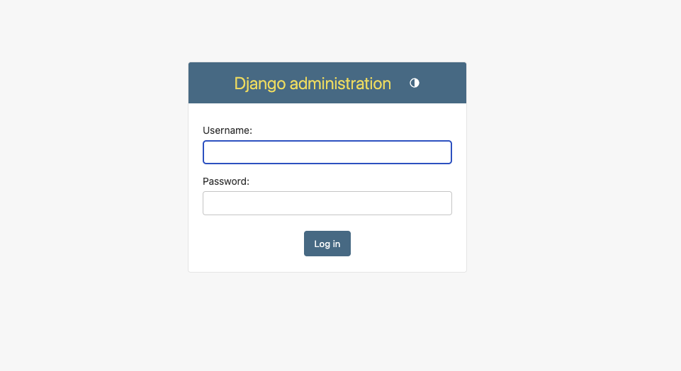
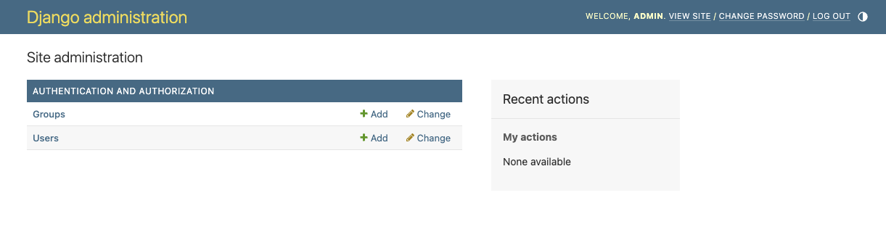
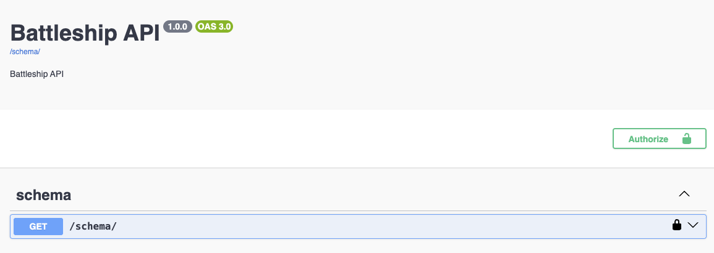
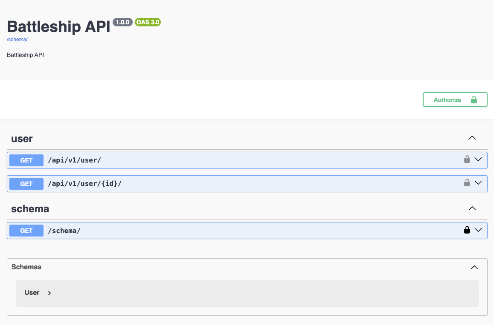
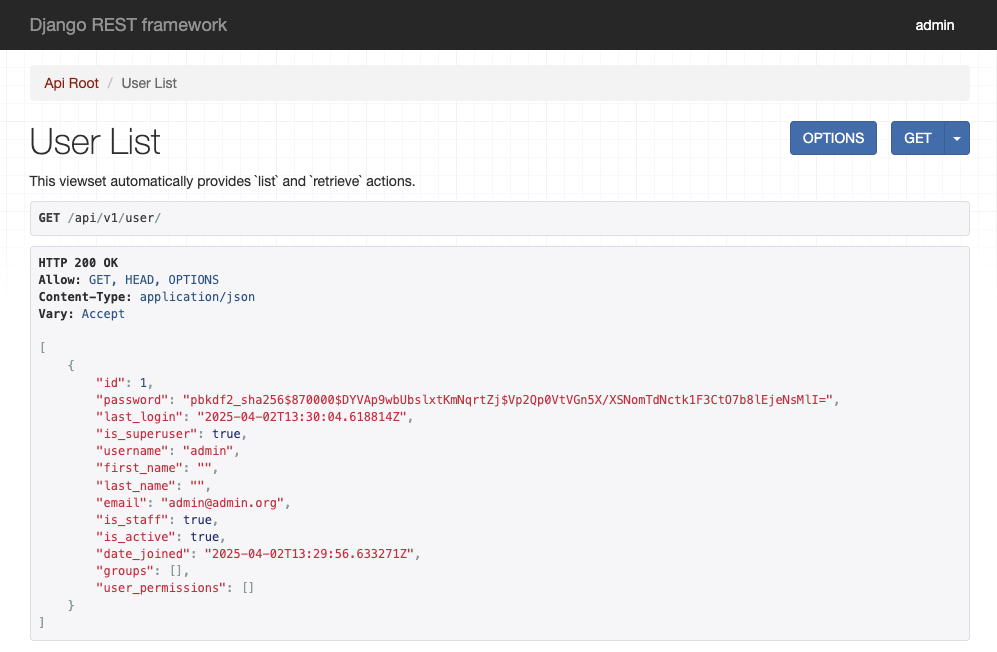
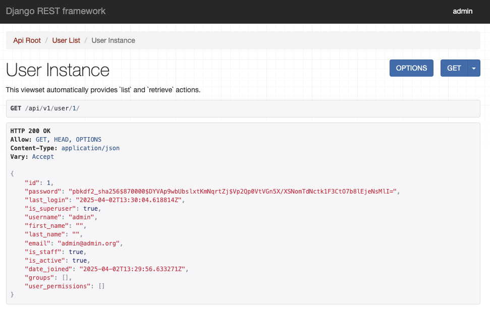

# Inicialització del backend amb DJango

## Crear entorn virtual de Python

La gestió de les dependències la farem utilitzant l'eina [Poetry](https://python-poetry.org/). Aquesta eina
permet definir les llibreries necessàries i crear un entorn virtual de Python amb aquestes llibreries i totes les
seves dependències. D'aquesta forma, evitem que hi hagi conflictes amb altres projectes de Python.

Per inicialitzar el projecte s'utilitza la comanda:

```bash
poetry new backend
```

que genera l'estructura bàsica del projecte **backend**. El fiter **pyproject.toml** conté tota la informació sobre el
projecte, inicialment informació molt bàsica com el nom, versió i descripció del nostre projecte. En el nostre cas no
estem creant un nou paquet de Python, sinó una aplicació, per tant afegirem la següent línia en el fitxer de configuració:

```toml
[tool.poetry]
package-mode = false
```

També podem eliminar la carpeta **backend** que conté el paquet buit creat incialment per Poetry.

A partir d'aquí, cal entrar dins el nou directori (on hi ha el fitxer pyproject.toml) i afegir els paquets necessàris.
Afegirem els paquests principals amb la comanda:

```bash
poetry add django djangorestframework drf-spectacular
```

De la mateixa manera, també podem afegir paquets que només necessitem per a la fase de desenvolupament, com els que ens
serveixen per passar les proves al codi o comprovar la seva correctesa. Podem afegir també aquestes dependències amb la
comanda:

```bash
poetry add pytest pylint allure-pytest --group dev
```

Per tal de treballar en l'entorn virtual gestionat per Poetry, ho podem fer de dues maneres:

1. Activar l'entorn amb `poetry shell`, que farà que s'utilitzi l'entorn virtual de python en tot el que fem a
   partir d'aquest moment, fins que executem `deactivate`.
2. Utilitzar explicitament l'entorn, afegint `poetry run` abans de cada comanda que es vulgui executar dins de
   l'entorn virtual. Per exemple, `poetry run python --version` executaria la comanda `python --version` dins de
   l'entorn virtual.

Recorda utilitzar un d'aquests mètodes en la resta de la guia.

## Inicialitzar el projecte DJango

[DJango](https://www.djangoproject.com/) és un entorn per al desenvolupament d'aplicacions en python. Per crear el projecte inicial, caldrà executar la següent comanda (cal haver eliminat la carpeta **backend** en el pas
anterior, o tindrem conflictes):

```bash
django-admin startproject backend
```

Aquesta comanda ens haurà tornat a crear una carpeta backend, amb un fitxer **manage.py** el seu interior (entre altres coses).
El fitxer **manage.py** és el que ens permet interactuar amb DJango. A continuació el farem servir per tal de preparar
la base de dades i arrancar el projecte.

### Configuració

Tota la configuració de DJango es fa a través d'un fitxer de configuració. Aquest fitxer el podeu trobar a
`/backend/backend/backend/settings.py`. A mesura que anem afegint components al nostre projecte, caldrà
afegir la configuració pertinent.

Podem afegir funcionalitats al DJango via **aplicacions**, ja sigui les que fem nosaltres com
les que ja existeixen. Per començar, indicarem a DJango que volem que utilitzi dues aplicacions
que hem instal·lat prèviament amb el django. Per fer-ho, modificarem la llista d'aplicacions instal·lades
**INSTALLED_APPS** dins el fitxer de configuració, afegint `rest_framework` i `drf_spectacular` al final:

```python
INSTALLED_APPS = [
    'django.contrib.admin',
    'django.contrib.auth',
    'django.contrib.contenttypes',
    'django.contrib.sessions',
    'django.contrib.messages',
    'django.contrib.staticfiles',
    'rest_framework',
    'drf_spectacular',
]
```

### Creació de la base de dades

DJango ens proporciona un sistema de gestió de migracions de la base de dades molt potent, que permet gestionar directament
la creació i actualització de la base de dades per adaptar-la a la nostra aplicació, però també a totes les aplicacions
existents que li afegim. Veurem el tema de migracions a la pràctica, de moment simplement aplicarem les que ja existeixen
amb la comanda:

```bash
python manage.py migrate
```

Si la comanda ha funcionat correctament, hauríeu de veure que s'ha creat un nou fitxer `db.sqlite3`, que conté la base de dades [SQLite](https://www.sqlite.org/).
El nom del fitxer i el tipus de base de dades estan definits en la següent porció del fitxer `settings.py`:

```python
from pathlib import Path

# Build paths inside the project like this: BASE_DIR / 'subdir'.
BASE_DIR = Path(__file__).resolve().parent.parent

# Database
# https://docs.djangoproject.com/en/5.0/ref/settings/#databases

DATABASES = {
    'default': {
        'ENGINE': 'django.db.backends.sqlite3',
        'NAME': BASE_DIR / 'db.sqlite3',
    }
}
```

### Iniciar el servidor

Un cop tenim la base de dades creada, ja podem comprovar que el nostre servidor funciona. Per arrancar el servidor,
cal executar la comanda:

```bash
python manage.py runserver
```

Si tot ha anat bé, hauríeu de poder accedir amb un navegador a l'adreça [http://127.0.0.1:8000/](http://127.0.0.1:8000/), i veure la pàgina inicial de DJango.

## Afegir noves rutes a l'aplicació

Un altre fitxer important del projecte DJango és el fitxer de rutes `urls.py`. En aquest fitxer es fa una declaració de les URL amb les funcionalitats del backend (normalment vistes).
A continuació veurem rutes útils de cara a l'aplicació.

### Administració de l'aplicació

Fixem-nos en el següent contingut del fitxer `urls.py`:

```python
from django.contrib import admin
from django.urls import path
urlpatterns = [
    path('admin/', admin.site.urls),
]
```

El que estem fent és vincular la ruta `admin/` amb `admin.site.urls`, que defineix un seguit de rutes per a la part d'administració de DJango.
A partir d'aquest moment, podem accedir a la part d'administració de la nostra aplicació amb aquesta ruta:

[http://127.0.0.1:8000/admin/](http://127.0.0.1:8000/admin/)

Fixeu-vos que la ruta s'afegeix a l'URL. Haurieu de poder veure una captura d'aquest estil:

<figure>
  
  <figcaption>Vista d'autenticació de l'administrador de DJango</figcaption>
</figure>

Per defecte, **només els administradors** de l'aplicació poden accedir a la part d'administració. Per crear un administrador ho podem fer
amb la comanda:

```bash
python manage.py createsuperuser
```

Se'ns demanarà les dades de l'administrador, entre elles l'usuari i la contrasenya. Si utilitzem aquestes credencials veurem el següent contingut:

<figure>
  
  <figcaption>Vista de l'administrador de DJango</figcaption>
</figure>

Si ens fixem bé, tenim dos models que ens venen donats, el dels usuaris (**User**) i el dels grups d'usuaris (**Group**). Si
entrem a la d'usuaris veurem que ens apareix l'usuari administrador que acabem de crear.

### Documentació de l'API

El mòdul `drf_spectacular` que hem instal·lat i activat anteriorment ens permet visualitzar l'ajuda de l'API de forma
automàtica, seguint un format estàndard anomenat [OpenAPI](https://www.openapis.org/), i visualitzant-lo amb l'eina **Swagger**.
Per fer-ho, primer afegirem les següents configuracions al final del fitxer `settings.py`:

```python
SPECTACULAR_SETTINGS = {
    'TITLE': 'Battleship API',
    'DESCRIPTION': 'Battleship API',
    'VERSION': '1.0.0',
    # include schema endpoint into schema
    'SERVE_INCLUDE_SCHEMA': True,
    # A regex specifying the common denominator for all operation paths. If
    # SCHEMA_PATH_PREFIX is set to None, drf-spectacular will attempt to estimate
    # a common prefix. Use '' to disable.
    # Mainly used for tag extraction, where paths like '/api/v1/albums' with
    # a SCHEMA_PATH_PREFIX regex '/api/v[0-9]' would yield the tag 'albums'.
    'SCHEMA_PATH_PREFIX': '/api/v[0-9]'
    # OTHER SETTINGS
}

REST_FRAMEWORK = {
    # Use Django's standard `django.contrib.auth` permissions,
    # or allow read-only access for unauthenticated users.
    'DEFAULT_PERMISSION_CLASSES': [
        'rest_framework.permissions.DjangoModelPermissionsOrAnonReadOnly'
    ],
    'DEFAULT_SCHEMA_CLASS': 'drf_spectacular.openapi.AutoSchema',
}
```

Ara registrarem dues noves **URL** a la nostra aplicació, dins el fitxer `urls.py`:

```python
from django.contrib import admin
from django.urls import path
from drf_spectacular.views import SpectacularAPIView, SpectacularSwaggerView
urlpatterns = [
    path('admin/', admin.site.urls),
    path("schema/", SpectacularAPIView.as_view(), name="schema"),
    path("docs/", SpectacularSwaggerView.as_view(url_name="schema"),name="swagger-ui"),
]
```

El primer que fem és afegir la url `schema/` per accedir a l'esquema OpenAPI de la nostra API. Després registrem una segona
url `docs/` que visualitzarà gràficament aquest esquema amb Swagger.

Ara ja podem visualitzar l'ajuda de la nostra aplicació anant a la url de documentació:

[http://127.0.0.1:8000/docs/](http://127.0.0.1:8000/docs/)

Haurieu de poder veure una vista d'aquest estil:

<figure>
  
  <figcaption>Vista de la documentació Swagger</figcaption>
</figure>

Fixeu-vos en la relació entre la configuració i el que es veu, en concret amb el títol, versions, etc...

### Afegir funcionalitats a l'API

Finalment, anem a veure com afegir una nova funcionalitat a la nostra API. En aquest cas, utilitzarem el mòdul `rest_framework`
que hem instal·lat i activat anteriorment. Quan hem configurat la documentació ja hem inclòs una configuració inicial
per aquest mòdul, per tant, per ara no necessitem configurar res més.

Hem vist anteriorment que per defecte ja tenim el model d'usuaris (**User**), i com podem accedir-hi utilitzant la part d'administració del DJango.
Ara el que farem serà afegir a l'API les funcionalitats de llistar els usuaris existents i veure les dades d'un usuari en particular.

Per fer-ho, necessitem fer dos passos. Primer definirem com passarem d'un model a una representació que puguem enviar, per exemple JSON o XML. Crea un fitxer `serializers.py` amb el següent contingut:

```python
from django.contrib.auth.models import User
from rest_framework import serializers

class UserSerializer(serializers.ModelSerializer):
    class Meta:
        model = User
        fields = '__all__'
```

En aquest fitxer definint un serialitzador **UserSerializer** que donat una instància de **User** en mostra tots els seus camps (fields).
Ara crearem una **Vista de Model** [ModelViewSet](https://www.django-rest-framework.org/tutorial/6-viewsets-and-routers/), que ens permetrà interactuar amb un model de l'aplicació (en aquest cas **User**). Creem un nou fitxer `views.py`:

```python
from rest_framework import viewsets
from django.contrib.auth.models import User
from . import serializers

class UserViewSet(viewsets.ReadOnlyModelViewSet):
    queryset = User.objects.all()
    serializer_class = serializers.UserSerializer
```

Simplement, li direm que aquesta vista, que limitarem a només lectura utilitzant **ReadOnlyModelViewSet** retornarà tots els objectes de tipus **User**, i que la informació la mostrarà amb el serialitzador anterior.
Per connectar aquesta vista amb l'aplicació, caldrà tornar definir les rutes pertinents al fitxer `urls.py`. En aquest cas, en comptes de posar una ruta
directament, utilitzarem els enrutadors del mòdul `rest_framework`, que ens ho faciliten. Fixeu-vos com quedaría el fitxer `urls.py`:

```python
from django.contrib import admin
from django.urls import path, include
from drf_spectacular.views import SpectacularAPIView, SpectacularSwaggerView
from rest_framework.routers import DefaultRouter
from . import views

# Create a router and register our ViewSets with it.
router = DefaultRouter()

router.register(r'user', views.UserViewSet, basename='user')
urlpatterns = [
    path('admin/', admin.site.urls),
    path("schema/", SpectacularAPIView.as_view(), name="schema"),
    path("docs/", SpectacularSwaggerView.as_view(url_name="schema"),name="swagger-ui"),
    path("api/v1/", include(router.urls)),
]
```

En l'enrutador (router) vinculem la nova vista UserViewSet amb la url `user`, i posteriorment, indiquem que tot el
que estigui definit dins aquest enrutador ho accedirem a partir de la ruta `api/v1/`. Per tant, veurem que aquesta
nova vista ens queda mapejada a la URL `api/v1/user/`.

Anem a comprovar que la pàgina de documentació ens mostra aquesta nova funcionalitat:

<figure>
  
  <figcaption>Vista de la documentació Swagger</figcaption>
</figure>

Podem accedir a la llista d'usuaris navegant a l'adreça [http://127.0.0.1:8000/api/v1/user/](http://127.0.0.1:8000/api/v1/user/):

<figure>
  
  <figcaption>Llistat d'usuaris.</figcaption>
</figure>

I a un usuari en concret, afegint el seu identificador al final [http://127.0.0.1:8000/api/v1/user/1/](http://127.0.0.1:8000/api/v1/user/1/)

<figure>
  
  <figcaption>Visualització d'un sol usuari.</figcaption>
</figure>
