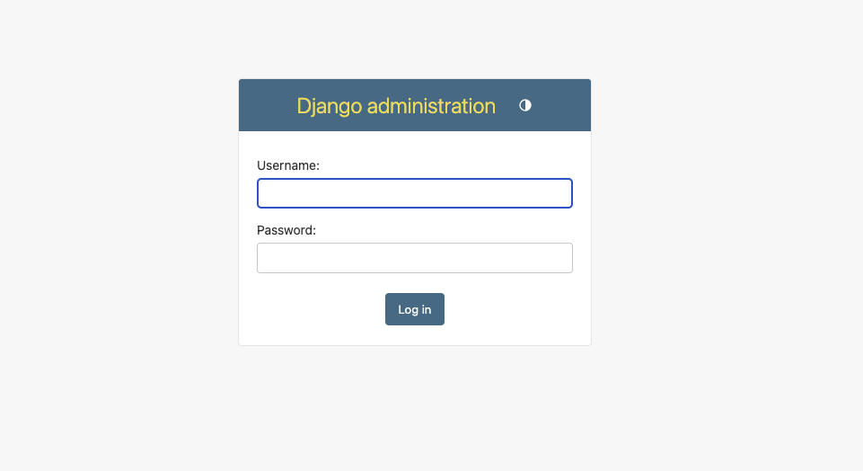
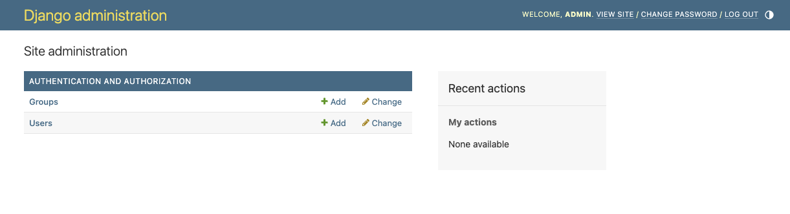
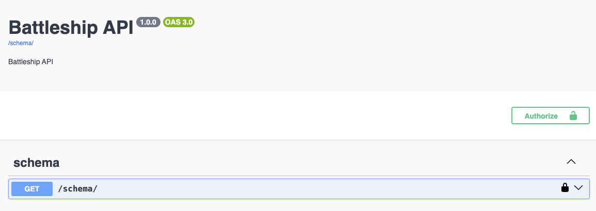
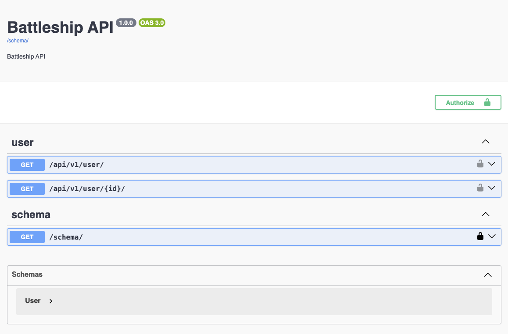

# Backend Initialization with DJango

## Creating a Python Virtual Environment

We will manage dependencies using the tool [Poetry](https://python-poetry.org/). This tool allows us to define the required libraries and create a Python virtual environment with these libraries and all their dependencies. This way, we avoid conflicts with other Python projects.

To initialize the project, use the command:

```bash
poetry new backend
```

which generates the basic structure of the **backend** project. The **pyproject.toml** file contains all the information about the project, initially just basic information such as the name, version, and description of our project. In our case, we are not creating a new Python package, but an application, so we will add the following line to the configuration file:

```toml
[tool.poetry]
package-mode = false
```

We can also delete the **backend** folder that contains the empty package initially created by Poetry.
From here, you need to enter the new directory (where the `pyproject.toml` file is located) and add the necessary packages.  
We'll add the main packages using the command:

```bash
poetry add django djangorestframework drf-spectacular
```

Similarly, we can also add packages that are only needed for the development phase, such as those used to run tests on the code or check its correctness.  
We can add these dependencies with the command:

```bash
poetry add pytest pylint allure-pytest --group dev
```

To work within the virtual environment managed by Poetry, we can do it in two ways:

1. Activate the environment with `poetry shell`, which will make the Python virtual environment used for everything we do from that point on, until we run `deactivate`.
2. Explicitly use the environment by adding `poetry run` before each command you want to execute within the virtual environment. For example, `poetry run python --version` would run the `python --version` command inside the virtual environment.

Remember to use one of these methods throughout the rest of the guide.

## Initialize the Django project

[DJango](https://www.djangoproject.com/) is a framework for developing Python applications. To create the initial project, you need to run the following command (make sure the **backend** folder has been deleted in the previous step, or you will run into conflicts):

```bash
django-admin startproject backend
```

This command will have created a new **backend** folder, containing a **manage.py** file (among other things).  
The **manage.py** file allows us to interact with Django. We'll use it next to prepare the database and start the project.

### Configuration

All Django configuration is done through a configuration file, which you can find at  
`/backend/backend/backend/settings.py`. As we add components to our project, we’ll need to update this file accordingly.

We can add functionality to Django via **applications**, either ones we create or existing ones.  
To start, we’ll tell Django to use two applications we previously installed with Django.  
To do this, modify the **INSTALLED_APPS** list in the configuration file by adding `rest_framework` and `drf_spectacular` at the end:

```python
INSTALLED_APPS = [
    'django.contrib.admin',
    'django.contrib.auth',
    'django.contrib.contenttypes',
    'django.contrib.sessions',
    'django.contrib.messages',
    'django.contrib.staticfiles',
    'rest_framework',
    'drf_spectacular',
]
```

### Database creation

Django provides a powerful database migration management system, which allows us to handle the creation and updating of the database to fit our application, as well as any existing applications we add.
We’ll explore migrations in practice later on—for now, we’ll simply apply the existing ones with the command:

```bash
python manage.py migrate
```

### Start the server

Once the database is created, we can check that our server is working. To start the server, run the command:

```bash
python manage.py runserver
```

If everything went well, you should be able to access the address
[http://127.0.0.1:8000/](http://127.0.0.1:8000/) with a browser, and see the DJango home page.

## Add a new application

Another important file in the Django project is the route file `urls.py`. In this file, you declare the URLs along with the backend functionalities (usually views).  
Next, we will see useful routes for the application.

### Application Administration

Let’s take a look at the following content from the `urls.py` file:

```python
from django.contrib import admin
from django.urls import path
urlpatterns = [
    path('admin/', admin.site.urls),
]
```

What we are doing here is linking the `admin/` path to `admin.site.urls`, which defines a set of routes for Django’s admin interface.  
From this point, we can access the admin section of our application with this URL:

[http://127.0.0.1:8000/admin/](http://127.0.0.1:8000/admin/)

Note that the route is added to the URL. You should see a screen like this:

<figure>
  
  <figcaption>Django Admin authentication view</figcaption>
</figure>

By default, **only administrators** of the application can access the admin section. To create an administrator, we can use the command:

```bash
python manage.py createsuperuser
```

We’ll be prompted to enter the admin information, including username and password. If we use these credentials, we’ll see the following:

<figure>
  
  <figcaption>Django Admin view</figcaption>
</figure>

If we look closely, we have two default models provided: the users model (**User**) and the user groups model (**Group**).  
If we enter the users section, we’ll see the admin user we just created.

### API Documentation

The `drf_spectacular` module we installed and enabled earlier allows us to view API documentation automatically, following a standard format called [OpenAPI](https://www.openapis.org/), and visualize it using the **Swagger** tool.  
To do this, first add the following configuration to the end of the `settings.py` file:

```python
SPECTACULAR_SETTINGS = {
    'TITLE': 'Battleship API',
    'DESCRIPTION': 'Battleship API',
    'VERSION': '1.0.0',
    # include schema endpoint into schema
    'SERVE_INCLUDE_SCHEMA': True,
    # A regex specifying the common denominator for all operation paths. If
    # SCHEMA_PATH_PREFIX is set to None, drf-spectacular will attempt to estimate
    # a common prefix. Use '' to disable.
    # Mainly used for tag extraction, where paths like '/api/v1/albums' with
    # a SCHEMA_PATH_PREFIX regex '/api/v[0-9]' would yield the tag 'albums'.
    'SCHEMA_PATH_PREFIX': '/api/v[0-9]'
    # OTHER SETTINGS
}

REST_FRAMEWORK = {
    # Use Django's standard `django.contrib.auth` permissions,
    # or allow read-only access for unauthenticated users.
    'DEFAULT_PERMISSION_CLASSES': [
        'rest_framework.permissions.DjangoModelPermissionsOrAnonReadOnly'
    ],
    'DEFAULT_SCHEMA_CLASS': 'drf_spectacular.openapi.AutoSchema',
}
```

Now we’ll register two new **URLs** in our application, inside the `urls.py` file:

```python
from django.contrib import admin
from django.urls import path
from drf_spectacular.views import SpectacularAPIView, SpectacularSwaggerView
urlpatterns = [
    path('admin/', admin.site.urls),
    path("schema/", SpectacularAPIView.as_view(), name="schema"),
    path("docs/", SpectacularSwaggerView.as_view(url_name="schema"),name="swagger-ui"),
]
```

The first thing we do is add the `schema/` URL to access our API's OpenAPI schema. Then, we register a second URL `docs/` that graphically displays the schema using Swagger.

Now we can view the application’s documentation by going to the following URL:

[http://127.0.0.1:8000/docs/](http://127.0.0.1:8000/docs/)

You should see a view like this:

<figure>
  
  <figcaption>Swagger documentation view</figcaption>
</figure>

Note the relationship between the configuration and what’s displayed — particularly the title, version, etc.

### Adding Functionality to the API

Finally, let’s look at how to add new functionality to our API. In this case, we’ll use the `rest_framework` module we installed and enabled earlier.  
When we configured the documentation, we already included some initial configuration for this module, so for now, we don’t need to configure anything else.

We saw earlier that by default we already have the users model (**User**), and we can access it using Django’s admin panel.  
Now we’ll add API functionality to list existing users and view the data of a specific user.

To do this, we need to take two steps. First, we’ll define how to convert a model into a representation we can send, such as JSON or XML. Create a file `serializers.py` with the following content:

```python
from django.contrib.auth.models import User
from rest_framework import serializers

class UserSerializer(serializers.ModelSerializer):
    class Meta:
        model = User
        fields = '__all__'
```

In this file, we define a serializer **UserSerializer** that, given a **User** instance, displays all of its fields.  
Now we’ll create a **Model View** [ModelViewSet](https://www.django-rest-framework.org/tutorial/6-viewsets-and-routers/), which will allow us to interact with a model (in this case, **User**). Create a new file `views.py`:

```python
from rest_framework import viewsets
from django.contrib.auth.models import User
from . import serializers

class UserViewSet(viewsets.ReadOnlyModelViewSet):
    queryset = User.objects.all()
    serializer_class = serializers.UserSerializer
```

We simply tell this view (which we limit to read-only using **ReadOnlyModelViewSet**) to return all **User** objects and to display the information using the previously defined serializer.  
To connect this view to the application, we need to define the relevant routes again in `urls.py`. In this case, instead of adding a route directly, we’ll use routers from the `rest_framework` module to make it easier.  
Here’s how the `urls.py` file would look:

```python
from django.contrib import admin
from django.urls import path, include
from drf_spectacular.views import SpectacularAPIView, SpectacularSwaggerView
from rest_framework.routers import DefaultRouter
from . import views

# Create a router and register our ViewSets with it.
router = DefaultRouter()

router.register(r'user', views.UserViewSet, basename='user')
urlpatterns = [
    path('admin/', admin.site.urls),
    path("schema/", SpectacularAPIView.as_view(), name="schema"),
    path("docs/", SpectacularSwaggerView.as_view(url_name="schema"),name="swagger-ui"),
    path("api/v1/", include(router.urls)),
]
```

In the router, we link the new **UserViewSet** view to the `user` URL, and afterward, we indicate that everything defined in this router will be accessible via the route `api/v1/`.  
Therefore, this new view is mapped to the URL `api/v1/user/`.

Let’s check that the documentation page now shows this new functionality:

<figure>
  
  <figcaption>Swagger documentation view</figcaption>
</figure>

We can access the list of users by navigating to: [http://127.0.0.1:8000/api/v1/user/](http://127.0.0.1:8000/api/v1/user/):

<figure>
  
  <figcaption>List of users.</figcaption>
</figure>

And to view a specific user, append their ID to the end: [http://127.0.0.1:8000/api/v1/user/1/](http://127.0.0.1:8000/api/v1/user/1/)

<figure>
  
  <figcaption>View of a single user.</figcaption>
</figure>
