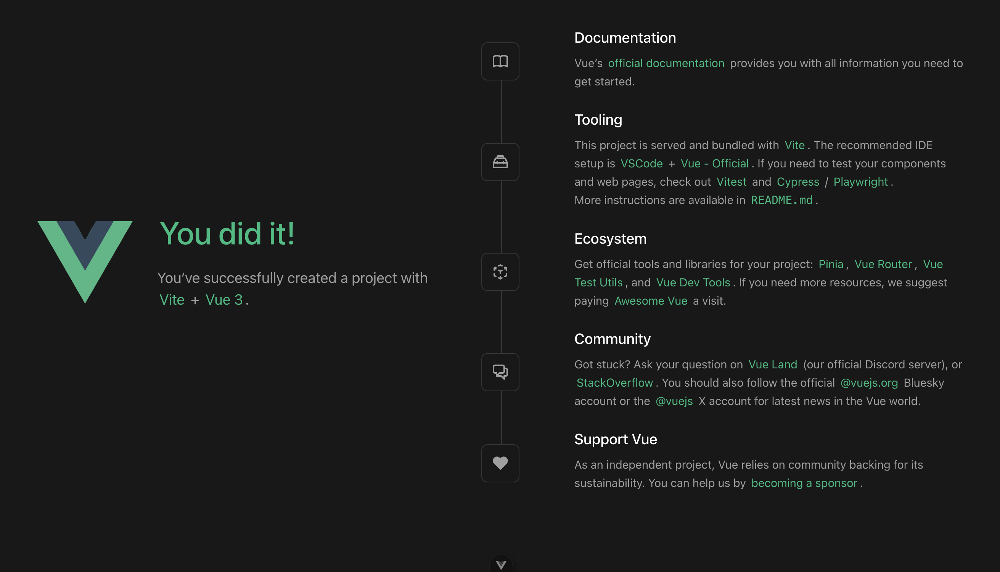

# Introducció a Vue

Vue és un framework progressiu per a la construcció d'interfícies d'usuari, és a dir, per al costat del client. Tot i que Vue és més senzill que React o Angular, és extremadament potent i es pot utilitzar per crear aplicacions avançades, oferint una estructura organitzada per als projectes. Consta d'un conjunt de llibreries opcionals i llibreries de tercers, i compta amb una comunitat en creixement. A més, Vue està guanyant molta popularitat i té un futur prometedor.

## Iniciant un nou projecte Vue

Els passos següents han estat desenvolupats utilitzant la versió Vue3, la versió v21.2.0 de node.js i la versió v10.2.3 de npm, però pots fer servir la darrera versió disponible.

Després d'instal·lar Vue, comprova la versió de node:

    node --version

Si encara no tens node instal·lat o tens una versió antiga, ves a  
<https://nodejs.org/en/download/> i instal·la el paquet. Per verificar la instal·lació, fes servir les ordres següents:

    node --version
    npm --version

Si estàs en Linux, necessitaràs instal·lar Node Version Manager (NVM).  
Això et permetrà triar una versió específica de node. Per instal·lar-lo, pots seguir aquesta guia:  
<https://phoenixnap.com/kb/install-latest-node-js-and-nmp-on-ubuntu>.

Hi ha diverses maneres de crear un projecte Vue; en aquest cas, el instal·larem a través de npm.

    npm create vue@latest

Aquesta ordre instal·larà i executarà `create-vue`, l'eina oficial per a la creació d'esquelets de projectes Vue. Se't mostraran diferents opcions per configurar característiques opcionals com TypeScript i suport per a proves:

```sh
✔ Project name: … <your-project-name>
✔ Add TypeScript? … No / Yes
✔ Add JSX Support? … No / Yes
✔ Add Vue Router for Single Page Application development? … No / Yes
✔ Add Pinia for state management? … No / Yes
✔ Add Vitest for Unit testing? … No / Yes
✔ Add an End-to-End Testing Solution? … No / Cypress / Nightwatch / Playwright
✔ Add ESLint for code quality? … No / Yes
✔ Add Prettier for code formatting? … No / Yes
✔ Add Vue DevTools 7 extension for debugging? (experimental) … No / Yes

Scaffolding project in ./<your-project-name>...
Done.
```

Tria `No` prement enter a totes les preguntes.

To run install the necessary packages the project:

```sh
$ cd <your-project-name>
$ npm install
```

Podeu obtenir més informació a la guia d'instal·lació:  
<https://vuejs.org/guide/quick-start.html>.

Aquests passos inicials et crearan una estructura predefinida com la que es veu a continuació:

```sh
.
├── README.md
├── index.html
├── jsconfig.json
├── package.json
├── public
│   └── favicon.ico
├── src
│   ├── App.vue
│   ├── assets
│   │   ├── base.css
│   │   ├── logo.svg
│   │   └── main.css
│   ├── components
│   │   ├── HelloWorld.vue
│   │   ├── TheWelcome.vue
│   │   ├── WelcomeItem.vue
│   │   └── icons
│   │       ├── IconCommunity.vue
│   │       ├── IconDocumentation.vue
│   │       ├── IconEcosystem.vue
│   │       ├── IconSupport.vue
│   │       └── IconTooling.vue
│   └── main.js
└── vite.config.js
```

Executa el projecte amb la següent comanda:

```sh
$ npm run dev
```

Veureu que el servidor `Vite` s'arranca a la màquina local (localhost) en un port per defecte:

```sh
> my-vue-project@0.0.0 dev
> vite

Port 5173 is in use, trying another one...

  VITE v6.2.4  ready in 1046 ms

  ➜  Local:   http://localhost:5174/
  ➜  Network: use --host to expose
  ➜  Vue DevTools: Open http://localhost:5174/__devtools__/ as a separate window
  ➜  Vue DevTools: Press Option(⌥)+Shift(⇧)+D in App to toggle the Vue DevTools
  ➜  press h + enter to show help
```

Pots obrir l'aplicació amb qualsevol navegador web a la URL `http://localhost:5174/`:



## L'estructura del projecte

A continuació es mostra una visió general dels fitxers i carpetes més importants en un projecte per defecte de Vue 3:

- **`index.html`**: El fitxer HTML principal. Vue munta la teva aplicació aquí mitjançant l'element `<div id="app"></div>`.

- **`main.js`**: El punt d'entrada de la teva aplicació. Aquest fitxer inicialitza Vue, munta el component arrel (`App.vue`) i configura qualsevol connector o configuració global.

- **`App.vue`**: El component arrel de Vue. Tots els altres components es troben dins d'aquest. Normalment, conté el disseny base o la lògica de navegació.

- **`components/`**: Aquesta carpeta conté components reutilitzables de Vue. Per exemple:

  - `HelloWorld.vue`, `TheWelcome.vue`: Components d'exemple inclosos en la plantilla.
  - `WelcomeItem.vue`: Un component més petit utilitzat per `TheWelcome.vue`.
  - `icons/`: Subcarpeta per a components d'icones, com `IconDocumentation.vue` o `IconCommunity.vue`.

- **`assets/`**: Fitxers estàtics com imatges i CSS. Els fitxers d'aquesta carpeta es poden importar als components segons sigui necessari.

  - `base.css`, `main.css`: Fulls d'estil globals compartits a tota l'aplicació.
  - `logo.svg`: El logotip per defecte de Vue utilitzat a la pàgina d'inici.

- **`public/`**: Els fitxers en aquesta carpeta es serveixen tal qual. `favicon.ico` és la icona de la pestanya del navegador.

- **`package.json`**: Gestiona les dependències del projecte, els scripts i les metadades.

- **`vite.config.js`**: Fitxer de configuració per a Vite, l'eina de compilació que s'encarrega de servir i empaquetar la teva aplicació. Aquí pots personalitzar àlies, connectors i el comportament del servidor.

- **`jsconfig.json`**: Proporciona suport per a IntelliSense i àlies de camins en editors com VSCode.

Aquesta estructura és modular i escalable, cosa que facilita l'addició de més components, vistes i funcionalitats a mesura que creix la teva aplicació.

## Conceptes bàsics de Vue

Aquesta secció introdueix els conceptes fonamentals de Vue mitjançant exemples senzills.

### Estructura dels fitxers Vue

Els components de Vue normalment es creen en fitxers `.vue` utilitzant el format de Component d'Arxiu Únic (SFC - Single File Component):


```vue
<template>
  <h1>{{ message }}</h1>
</template>

<script>
export default {
  data() {
    return {
      message: "Hello from Vue!",
    };
  },
};
</script>

<style>
h1 {
  color: #42b983;
}
</style>
```

- `<template>` conté l'HTML

- `<script>` conté la lògica

- `<style>` conté els estils locals o globals

### Enllaçar dades

Utilitza `{{ variable }}` per enllaçar les dades al DOM:

```vue
<template>
  <p>{{ greeting }}</p>
</template>

<script>
export default {
  data() {
    return {
      greeting: "Welcome to Vue!",
    };
  },
};
</script>
```

### Gestió d'esdeveniments

Utilitza `@click` per vincular un gestor (handler) al botó del ratolí:

```vue
<template>
  <button @click="count++">Clicked {{ count }} times</button>
</template>

<script>
export default {
  data() {
    return {
      count: 0,
    };
  },
};
</script>
```

### Visualització Condicional

Podeu utilitzar `v-if`, `v-else-if`, i `v-else`:

```vue
<template>
  <p v-if="isAdmin">Welcome, admin!</p>
  <p v-else>Welcome, user!</p>
</template>

<script>
export default {
  data() {
    return {
      isAdmin: false,
    };
  },
};
</script>
```

### Llistes i bucles

Utilitzeu `v-for` per visualitzar llistes:

```vue
<template>
  <ul>
    <li v-for="fruit in fruits" :key="fruit">{{ fruit }}</li>
  </ul>
</template>

<script>
export default {
  data() {
    return {
      fruits: ["Apple", "Banana", "Cherry"],
    };
  },
};
</script>
```

### Formularis i v-model

Vinculació de doble sentit amb `v-model`:

```vue
<template>
  <input v-model="name" />
  <p>Hello, {{ name }}!</p>
</template>

<script>
export default {
  data() {
    return {
      name: "",
    };
  },
};
</script>
```

### Props i comunicació amb els components

Podem passar dades a components fills utilitzant l'atribut `props`:

```vue
<!-- Parent.vue -->
<template>
  <ChildComponent message="Hello from parent!" />
</template>

<script>
import ChildComponent from "./ChildComponent.vue";

export default {
  components: { ChildComponent },
};
</script>
```

```vue
<!-- ChildComponent.vue -->
<template>
  <p>{{ message }}</p>
</template>

<script>
export default {
  props: ["message"],
};
</script>
```

### Esdeveniments del cicle de vida

Els components Vue tenen esdeveniments vinculats al seu cicle de vida, com per exemple `mounted()`:

```vue
<script>
export default {
  mounted() {
    console.log("Component mounted!");
  },
};
</script>
```

## Lectures addicionals i exercicis

Recomanem seguir els tutorials oficials pas a pas per provar en la pràctica les funcionalitats bàsiques de Vue a: <https://vuejs.org/tutorial>

A més, pots explorar característiques més avançades que s'utilitzaran més endavant a les sessions pràctiques, com ara:

- [Vue Router](https://router.vuejs.org/guide/) per definir la navegació.
- [Axios](https://axios-http.com/docs/intro) per consumir APIs REST.
