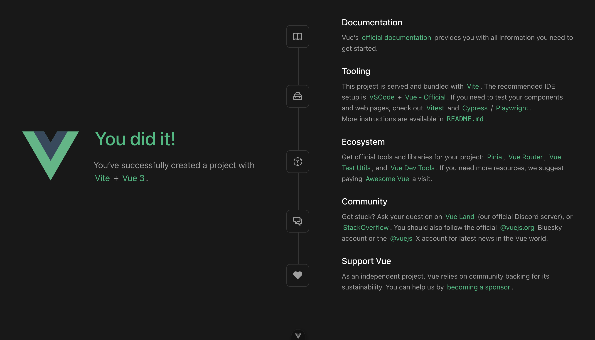

# Introduction to Vue

Vue is a progressive framework for building user interfaces, meaning on the client side. Although Vue is simpler than React or Angular, it is extremely powerful and can be used to create advanced applications, offering structured project creation. It consists of a set of optional libraries and third-party libraries, and has a growing community. Moreover, Vue is becoming very popular and has a bright future.

## Starting a new Vue project

The following steps were developed using version Vue3, node.js version v21.2.0, and npm version v10.2.3, but you can use the latest version available.

After installing Vue, check the node version:

    node --version

If you don’t have node installed yet or have an old version, go to  
<https://nodejs.org/en/download/> and install the package. To verify the installation, use the following command lines:

    node --version
    npm --version

If you're on Linux, you'll need to install Node Version Manager (NVM).  
It will allow you to choose a specific node version. To install it, you can follow this guide:  
<https://phoenixnap.com/kb/install-latest-node-js-and-nmp-on-ubuntu>.

There are several methods to create a Vue project; in this case, we will install it through npm.

    npm create vue@latest

This command will install and execute create-vue, the official Vue project scaffolding tool. You will be presented with prompts for several optional features such as TypeScript and testing support:

```sh
✔ Project name: … <your-project-name>
✔ Add TypeScript? … No / Yes
✔ Add JSX Support? … No / Yes
✔ Add Vue Router for Single Page Application development? … No / Yes
✔ Add Pinia for state management? … No / Yes
✔ Add Vitest for Unit testing? … No / Yes
✔ Add an End-to-End Testing Solution? … No / Cypress / Nightwatch / Playwright
✔ Add ESLint for code quality? … No / Yes
✔ Add Prettier for code formatting? … No / Yes
✔ Add Vue DevTools 7 extension for debugging? (experimental) … No / Yes

Scaffolding project in ./<your-project-name>...
Done.
```

Choose `No` by hitting enter for all of the entries.

To run install the necessary packages the project:

```sh
$ cd <your-project-name>
$ npm install
```

For more assistance, refer to the following installation guide:  
<https://vuejs.org/guide/quick-start.html>.

This initalization will give you a predefined project structure as shown here:

```sh
.
├── README.md
├── index.html
├── jsconfig.json
├── package.json
├── public
│   └── favicon.ico
├── src
│   ├── App.vue
│   ├── assets
│   │   ├── base.css
│   │   ├── logo.svg
│   │   └── main.css
│   ├── components
│   │   ├── HelloWorld.vue
│   │   ├── TheWelcome.vue
│   │   ├── WelcomeItem.vue
│   │   └── icons
│   │       ├── IconCommunity.vue
│   │       ├── IconDocumentation.vue
│   │       ├── IconEcosystem.vue
│   │       ├── IconSupport.vue
│   │       └── IconTooling.vue
│   └── main.js
└── vite.config.js
```

To run the project:

```sh
$ npm run dev
```

You will see that a `Vite` server is launched in localhost with a specific port:

```sh
> my-vue-project@0.0.0 dev
> vite

Port 5173 is in use, trying another one...

  VITE v6.2.4  ready in 1046 ms

  ➜  Local:   http://localhost:5174/
  ➜  Network: use --host to expose
  ➜  Vue DevTools: Open http://localhost:5174/__devtools__/ as a separate window
  ➜  Vue DevTools: Press Option(⌥)+Shift(⇧)+D in App to toggle the Vue DevTools
  ➜  press h + enter to show help
```

Open the browser at `http://localhost:5174/`:



## The project structure

Here is an overview of the most important files and folders in a default Vue 3 project:

- **`index.html`**: The main HTML file. Vue mounts your app here via the `<div id="app"></div>` element.

- **`main.js`**: The entry point of your application. This file initializes Vue, mounts the root component (`App.vue`), and sets up any plugins or global configurations.

- **`App.vue`**: The root Vue component. All other components are nested under this one. It typically contains the base layout or routing logic.

- **`components/`**: This folder contains reusable Vue components. For example:

  - `HelloWorld.vue`, `TheWelcome.vue`: Example components provided with the template.
  - `WelcomeItem.vue`: A smaller component used by `TheWelcome.vue`.
  - `icons/`: Subdirectory for icon components, such as `IconDocumentation.vue` or `IconCommunity.vue`.

- **`assets/`**: Static files like images and CSS. Files in this folder are imported into your components as needed.

  - `base.css`, `main.css`: Global styles that are shared across the app.
  - `logo.svg`: Default Vue logo used in the landing page.

- **`public/`**: Files in this folder are served as-is. `favicon.ico` is the browser tab icon.

- **`package.json`**: Manages project dependencies, scripts, and metadata.

- **`vite.config.js`**: Configuration file for Vite, the build tool used to serve and bundle your app. You can customize aliases, plugins, and server behavior here.

- **`jsconfig.json`**: Provides IntelliSense and path alias support in editors like VSCode.

This structure is modular and scalable, making it easy to add more components, views, and features as your application grows.

## Vue Basics

This section introduces you to the core concepts of Vue with simple, self-contained examples.

### Vue File Structure

Vue components are typically written in `.vue` files using the Single File Component (SFC) format:

```vue
<template>
  <h1>{{ message }}</h1>
</template>

<script>
export default {
  data() {
    return {
      message: "Hello from Vue!",
    };
  },
};
</script>

<style>
h1 {
  color: #42b983;
}
</style>
```

- `<template>` contains the HTML

- `<script>` contains the logic

- `<style>` contains scoped or global styles

### Data Binding

Use `{{ variable }}` to bind data to the DOM:

```vue
<template>
  <p>{{ greeting }}</p>
</template>

<script>
export default {
  data() {
    return {
      greeting: "Welcome to Vue!",
    };
  },
};
</script>
```

### Event Handling

Use `@click` to attach click handlers:

```vue
<template>
  <button @click="count++">Clicked {{ count }} times</button>
</template>

<script>
export default {
  data() {
    return {
      count: 0,
    };
  },
};
</script>
```

### Conditional Rendering

Use `v-if`, `v-else-if`, and `v-else`:

```vue
<template>
  <p v-if="isAdmin">Welcome, admin!</p>
  <p v-else>Welcome, user!</p>
</template>

<script>
export default {
  data() {
    return {
      isAdmin: false,
    };
  },
};
</script>
```

### Lists and Loops

Use `v-for` to render lists:

```vue
<template>
  <ul>
    <li v-for="fruit in fruits" :key="fruit">{{ fruit }}</li>
  </ul>
</template>

<script>
export default {
  data() {
    return {
      fruits: ["Apple", "Banana", "Cherry"],
    };
  },
};
</script>
```

### Forms and v-model

Two-way data binding with `v-model`:

```vue
<template>
  <input v-model="name" />
  <p>Hello, {{ name }}!</p>
</template>

<script>
export default {
  data() {
    return {
      name: "",
    };
  },
};
</script>
```

### Props and Component Communication

Pass data to child components using `props`:

```vue
<!-- Parent.vue -->
<template>
  <ChildComponent message="Hello from parent!" />
</template>

<script>
import ChildComponent from "./ChildComponent.vue";

export default {
  components: { ChildComponent },
};
</script>
```

```vue
<!-- ChildComponent.vue -->
<template>
  <p>{{ message }}</p>
</template>

<script>
export default {
  props: ["message"],
};
</script>
```

### Lifecycle Hooks

Vue components have lifecycle hooks like `mounted()`:

```vue
<script>
export default {
  mounted() {
    console.log("Component mounted!");
  },
};
</script>
```

## Further reading and exercises

We recommend to follow the official step-by-step tutorials to try the above Vue basic functionalities in practice in: <https://vuejs.org/tutorial>

Additionally, you can explore more advanced features that will be used later in the practical sessions like:

- [Vue Router](https://router.vuejs.org/guide/) for page navigation.
- [Axios](https://axios-http.com/docs/intro) for consuming REST API.
