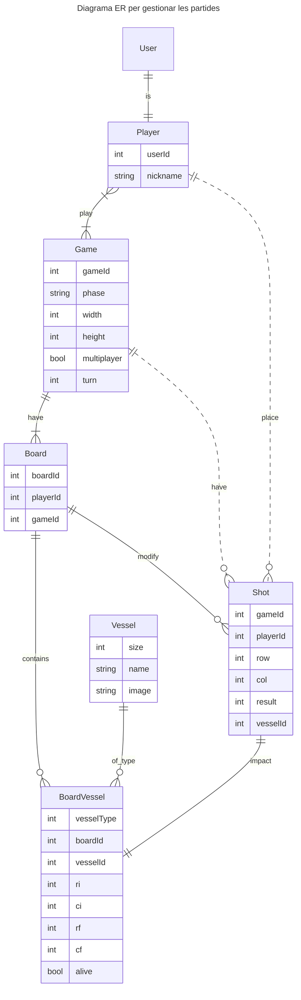

# Sessió 1

En aquesta sessió veurem les tecnologíes bàsiques amb les que treballarem durant aquesta pràctica.

## Objectius

- Creació d'un projecte amb [DJango](https://www.djangoproject.com/) [Backend]
- Creació d'un projecte amb [Vue](https://vuejs.org/) [Frontend]
- Revisió i posada en marxa del codi bàsic de la pràctica

## Introducció al Backend

El backend el definirem amb el framework [DJango](https://www.djangoproject.com/) de Python, el qual ens permet el
desenvolupament ràpid d'aplicacions web, incorporant mòduls per afegir funcionalitats. En el nostre cas, els principals
mòduls que incorporarem seran:
* [DJango Auth](https://docs.djangoproject.com/en/5.1/topics/auth/): És el sistema d'autenticació per defecte de DJango. Ens proporciona el model de l'usuari **User**, a més de mecanismes d'autenticació i autorització.
* [DJango Rest Framework](https://www.django-rest-framework.org/): És un framework que permet crear de forma fàcil una API Rest.
* [drf-spectacular](https://drf-spectacular.readthedocs.io/en/latest/): És un mòdul que ens permetrà generar automàticament l'ajuda de l'API.

### Models de dades

Una part important del backend seran els models de dades que utilitzarem per gestionar tota la informació. A continuació us presentem
el diagrama ER dels principals models que utilitzarem en aquesta pràctica. La gestió dels models el farem utilitzant
el sistema ORM (Object Relational mapping) de Django, basats en la classe [Model de DJango](https://docs.djangoproject.com/en/5.1/topics/db/models/). 
A continuació us expliquem breument els diferents models que utilitzarem. 

* **User:** És el [model que DJango](https://docs.djangoproject.com/en/5.1/topics/auth/default/) utilitza per representar els usuaris de l'aplicació. Veurem aquest model amb més detall quan parlem d'autenticació.
* **Player:** Aquest model representa un jugador, i ens permet afegir informació addicional a la bàsica d'un Usuari. Quedarà vinculada amb una relació 
* **Game:** És una partida, a la qual podrem assignar un o més jugadors. Guardarà l'estat i les dades de la partida.
* **Board:** Representa un tauler. Pertany a una partida i a un jugador.
* **Shot:** Guarda les tirades d'un jugador a una partida.
* **Vessel:** Guarda els vaixells que s'han ubicat a un tauler (Board).

Cal tenir en compte que el diagrama ER mostra només els camps principals, alguns dels quals pot ser que calgui gestionar-los via relacions entre les entitats.

