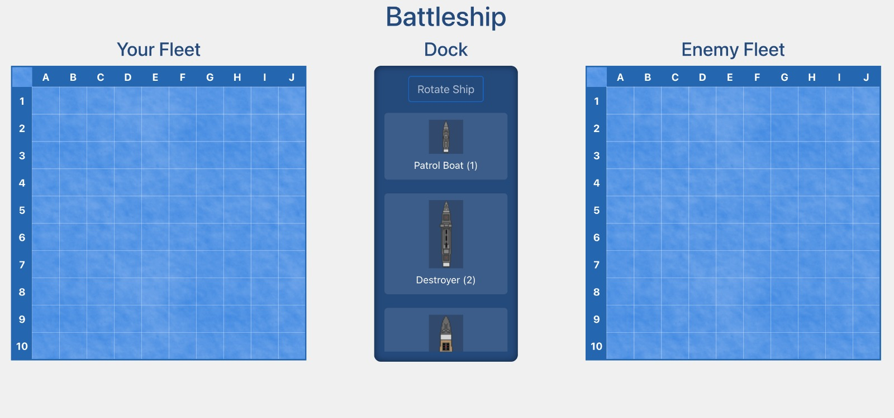
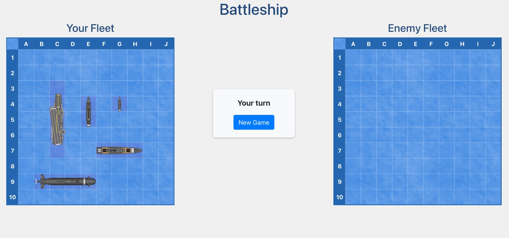

# Sessió 1

En aquesta sessió veurem les tecnologíes bàsiques amb les que treballarem durant aquesta pràctica.

## Objectius

- Creació d'un projecte amb [DJango](https://www.djangoproject.com/) [Backend]
- Creació d'un projecte amb [Vue](https://vuejs.org/) [Frontend]
- Revisió i posada en marxa del codi bàsic de la pràctica

## Introducció al Frontend

El frontend el definirem amb el framework de JavaScript [Vue](https://vuejs.org/), que ens permetrà visualitzar en tot moment l'estat de la partida i interacturar-hi. A continuació
podeu veure algunes captures de pantalla del resultat final que es busca:

<figure>
  
  <figcaption>Tauler a l'inici del joc</figcaption>
</figure>
<figure>
  
  <figcaption>Tauler amb els vaixells ubicats</figcaption>
</figure>
<figure>
  
  <figcaption>Tauler durant la partida</figcaption>
</figure>

Cal tenir en compte que el frontend actua com a **Client** en la nostra aplicació, i s'executa en la màquina de l'usuari dins d'un navegador web com Chrome, Mozilla, Edge o Safari.

## Introducció al Backend

El backend el definirem amb el framework [DJango](https://www.djangoproject.com/) de Python, el qual ens permet el
desenvolupament ràpid d'aplicacions web, incorporant mòduls per afegir funcionalitats. En el nostre cas, els principals
mòduls que incorporarem seran:

- [DJango Auth](https://docs.djangoproject.com/en/5.1/topics/auth/): És el sistema d'autenticació per defecte de DJango. Ens proporciona el model de l'usuari **User**, a més de mecanismes d'autenticació i autorització.
- [DJango Rest Framework](https://www.django-rest-framework.org/): És un framework que permet crear de forma fàcil una API Rest.
- [drf-spectacular](https://drf-spectacular.readthedocs.io/en/latest/): És un mòdul que ens permetrà generar automàticament l'ajuda de l'API.

Una de les responsabilitats del backend serà l'accés i de la base de dades, utilitzada per persistir els models de dades. Per gestionar el model
de dades de l'aplicació utilitzarem el sistema ORM (Object Relational mapping) de Django, basats en la classe [Model de DJango](https://docs.djangoproject.com/en/5.1/topics/db/models/). Aquest
sistema ens permet sincronitzar els models de dades definits a l'aplació (en codi Python) amb la base de dades (en comptes d'utilitzar Data Definition Language o DDL), mitjançant [migracions](https://docs.djangoproject.com/en/5.1/topics/migrations/).
La idea de les migracions és que, cada cop que modifiquem les dades a l'aplicació, es generaran uns scripts explicant els canvis que cal fer a la base de dades perquè estigui
sincronitzada amb els models. Aquestes migracions les haurem d'aplicar finalment per modificar l'estructura i contingut de la base de dades. Per defecte utilitzarem com a base de dades
**SQLite**, que és una base de dades amb un únic fitxer.

## Exercici 1

Segueix les indicacions de la guia d'[introducció a Vue](../Guies/inici_Vue.md) per tal de crear un projecte Vue des de zero i executar-lo.

## Exercici 2

Segueix les indicacions de la guia d'[introducció a DJango](../Guies/inici_DJango.md) per tal de crear un projecte DJango des de zero i executar-lo.
