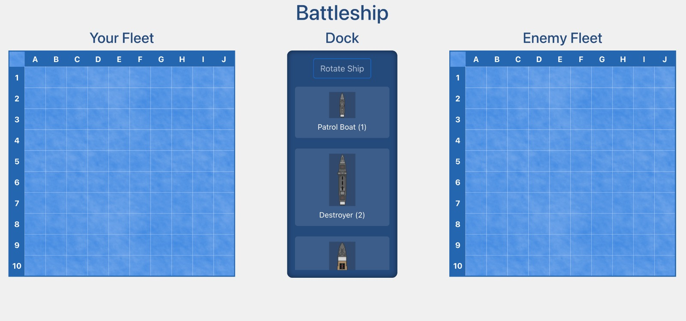
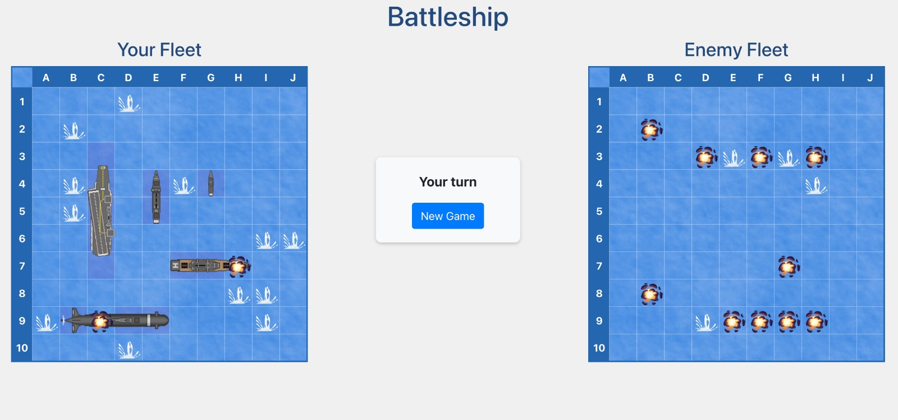
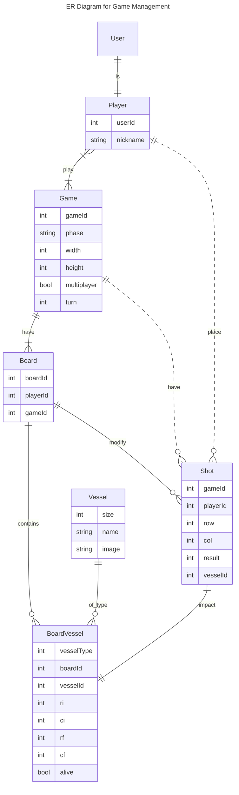

# Session 1

In this session, we will go over the basic technologies we will work with during this practical.

## Objectives

- Create a project using [Vue](https://vuejs.org/) [Frontend]
- Create a project using [DJango](https://www.djangoproject.com/) [Backend]

## Introduction to the Frontend

The fronted will be developed using the [VueJS](https://vuejs.org) library and communicate with the backend through RESTfull API calls. In the next session, you will be provided with a starting base code with a skeleton structure and functions. The rendering of the battleship game with main user interactions and visual assets (placing vessels on the board, shooting, etc) will be provided, but _without RESTfull API calls_.

## Introduction to the Backend

The backend will be defined using the Python framework [DJango](https://www.djangoproject.com/), which allows rapid development of web applications by incorporating modules for added functionalities. In our case, the main modules we will include are:

- [DJango Auth](https://docs.djangoproject.com/en/5.1/topics/auth/): DJango's default authentication system. It provides the **User** model along with authentication and authorization mechanisms.
- [DJango Rest Framework](https://www.django-rest-framework.org/): A framework that facilitates the creation of a REST API.
- [drf-spectacular](https://drf-spectacular.readthedocs.io/en/latest/): A module that will allow us to automatically generate the API documentation.

### Data Models

An important part of the backend will be the data models we use to manage all the information. Below is the ER diagram of the main models we will use in this practical. Model management will be done using Django's ORM (Object Relational Mapping) system, based on the [DJango Model class](https://docs.djangoproject.com/en/5.1/topics/db/models/). Below we briefly describe the different models we will use.

- **User:** The [model that DJango](https://docs.djangoproject.com/en/5.1/topics/auth/default/) uses to represent application users. We'll see this model in more detail when we cover authentication.
- **Player:** This model represents a player and allows us to add additional information to a User. It will be linked via a relationship.
- **Game:** A game session that can have one or more players assigned. It stores the state and data of the game.
- **Board:** Represents a board. Belongs to a game and a player.
- **Shot:** Stores the shots made by a player in a game.
- **Vessel:** Stores the ships placed on a board.

Note that the ER diagram only shows the main fields, some of which may need to be managed through entity relationships.

