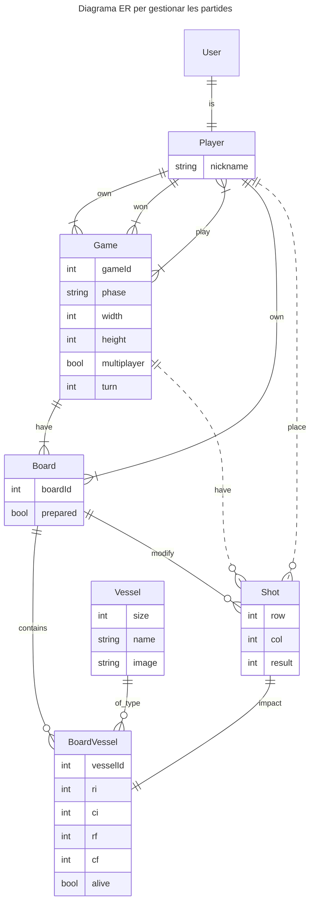

# Sessió 2

En aquesta sessió veurem les tecnologíes bàsiques amb les que treballarem durant aquesta pràctica.

## Objectius

- Creació d'un projecte amb [DJango](https://www.djangoproject.com/) [Backend]
- Creació d'un projecte amb [Vue](https://vuejs.org/) [Frontend]
- Revisió i posada en marxa del codi bàsic de la pràctica

## Introducció al Backend

El backend el definirem amb el framework [DJango](https://www.djangoproject.com/) de Python, el qual ens permet el
desenvolupament ràpid d'aplicacions web, incorporant mòduls per afegir funcionalitats. En el nostre cas, els principals
mòduls que incorporarem seran:
* [DJango Auth](https://docs.djangoproject.com/en/5.1/topics/auth/): És el sistema d'autenticació per defecte de DJango. Ens proporciona el model de l'usuari **User**, a més de mecanismes d'autenticació i autorització.
* [DJango Rest Framework](https://www.django-rest-framework.org/): És un framework que permet crear de forma fàcil una API Rest.
* [drf-spectacular](https://drf-spectacular.readthedocs.io/en/latest/): És un mòdul que ens permetrà generar automàticament l'ajuda de l'API.


### Models de dades

Una part important del backend seran els models de dades que utilitzarem per gestionar tota la informació. A continuació us presentem
el diagrama ER dels principals models que utilitzarem en aquesta pràctica. La gestió dels models el farem utilitzant
el sistema ORM (Object Relational mapping) de Django, basats en la classe [Model de DJango](https://docs.djangoproject.com/en/5.1/topics/db/models/). 
A continuació us expliquem breument els diferents models que utilitzarem. 

* **User:** És el [model que DJango](https://docs.djangoproject.com/en/5.1/topics/auth/default/) utilitza per representar els usuaris de l'aplicació. Veurem aquest model amb més detall quan parlem d'autenticació.
* **Player:** Aquest model representa un jugador, i ens permet afegir informació addicional a la bàsica d'un Usuari. Quedarà vinculada amb una relació 
* **Game:** És una partida, a la qual podrem assignar un o més jugadors. Guardarà l'estat i les dades de la partida.
* **Board:** Representa un tauler. Pertany a una partida i a un jugador.
* **Shot:** Guarda les tirades d'un jugador a una partida.
* **Vessel:** Guarda els vaixells que s'han ubicat a un tauler (Board).

Cal tenir en compte que el diagrama ER mostra només els camps principals, alguns dels quals pot ser que calgui gestionar-los via relacions entre les entitats.



### API

Tota la gestió de les dades es farà utilitzant l'API RESTful, seguint com a base la següent estructura (**podeu afegir** mètodes addicionals):


| Mètode | URL                                                 | Descripció                   |
| ------ | --------------------------------------------------- | ---------------------------- |
| GET    | `/api/v1/players/`                                    | Llistat de jugadors          |
| POST   | `/api/v1/players/`                                    | Crear un jugador            |
| GET    | `/api/v1/players/{id}/`                               | Veure la informació d'un jugador        |
| PUT    | `/api/v1/players/{id}/`                               | Modificar la informació d'un jugador    |
| PATCH  | `/api/v1/players/{id}/`                               | Modificar la informació d'un jugador   |
| DELETE | `/api/v1/players/{id}/`                               | Eliminar un jugador         |
| GET    | `/api/v1/games/`                                    | Llistat de partides          |
| POST   | `/api/v1/games/`                                    | Crear una partida            |
| GET    | `/api/v1/games/{id}/`                               | Veure la informació d'una partida        |
| PUT    | `/api/v1/games/{id}/`                               | Modificar la informació d'una partida    |
| PATCH  | `/api/v1/games/{id}/`                               | Modificar la informació d'una partida    |
| DELETE | `/api/v1/games/{id}/`                               | Eliminar una partida         |
| GET    | `/api/v1/games/{id}/players/`                       | Llistat de jugadors en una partida    |
| POST   | `/api/v1/games/{id}/players/`                       | Afegeix un jugador a una partida      |
| GET    | `/api/v1/games/{gid}/players/{pid}/`                | Veure les dades d'un jugador de la partida     |
| DELETE | `/api/v1/games/{gid}/players/{pid}/`                | Eliminar un jugador de la partida   |
| GET    | `/api/v1/games/{gid}/players/{pid}/vessels/`        | Veure els vaixells d'un usuari a la partida     |
| POST   | `/api/v1/games/{gid}/players/{pid}/vessels/`        | Afegir un vaixell per a un usuari i partida     |
| GET    | `/api/v1/games/{gid}/players/{pid}/vessels/{vid}/`  | Veure la informació d'un vaixell per a un jugador i partida   |
| PUT    | `/api/v1/games/{gid}/players/{pid}/vessels/{vid}/`  | Modificar la ubicació d'un vaixell per a un jugador i partida   |
| PATCH  | `/api/v1/games/{gid}/players/{pid}/vessels/{vid}/`  | Modificar la ubicació d'un vaixell per a un jugador i partida   |
| DELETE | `/api/v1/games/{gid}/players/{pid}/vessels/{vid}/`  | Eliminar un vaixell del tauler d'un jugador per a una partida   |
| GET    | `/api/v1/games/{gid}/players/{pid}/shots/`          | Veure les jugades fetes per un jugador a una partida    |
| POST   | `/api/v1/games/{gid}/players/{pid}/shots/`          | Fer una nova jugada d'un jugador a una partida     |
| GET    | `/api/v1/games/{gid}/players/{pid}/shots/{sid}/`    | Veure la informació d'una jugada per a un jugador i partida   |
| GET    | `/api/v1/games/{gid}/players/{pid}/boards/`         | Veure els taulers de joc per a un jugador i partida     |
| GET    | `/api/v1/games/{gid}/players/{pid}/boards/{bid}/`   | Veure un taulers de joc per a un jugador i partida     |


El cos dels missatges i els tipus de retorn els heu de decidir vosaltres, i han de quedar recollits a l'ajuda de la API i a la **memòria**.

**Nota:** En aquest moment l'API ens permetrà realitzar totes les accions independentment de si estem autenticats i no, i de l'usuari que siguem. Més endavant ens centrarem en la part d'autenticació i autorització.


## Tasques dins del laboratori

### Exercici 1

Segueix el següent enllaç a **Github Classroom** i descarrega't el codi per a la pràctica 2.

- [https://classroom.github.com/a/diHjdyim](https://classroom.github.com/a/diHjdyim)

Veureu que teniu dues carpetes:

- **frontend**: Versió inicial del frontend. Aquest codi parteix d'una versió similar a la obtinguda en els exercicis de la sessió anterior, però inclou alguns components ja implementats.

- **backend**: Versió inicial del backend. Aquest codi parteix d'una versió similar a la obtinguda en els exercicis de la sessió anterior, però inclou alguns paquests i configuracions inicials.


Executa els dos codis igual que es va fer a la sessió anterior.


### Exercici 2

Obre el codi del **backend** i revisa'n l'estructura. Fixa't que hi ha una carpeta ***api**. Aqui és on volem posar tota la part relativa a la API del backend. En concret, identifica la següent estructura:

| Component        | Finalitat                                     |
| ---------------- | --------------------------------------------- |
| `models.py`      | Defineix l'esquema de la base de dades        |
| `migrations`     | Paquet on es creen les migracions de dades    |
| `serializers.py` | Traducció models <-> dades en JSON            |
| `views.py`       | Defineix les vistes, que implementen la lògica de l'API             |
| `urls.py`        | Assigna rutes de l'API a les diferents vistes |
| `signals.py`     | Registre de senyals/events  |


### Exercici 3

El primer que volem fer és definir els models corresponents a **Player** i **Game**, tal com els hem vist representats en el model de dades anterior. Per fer-ho, obre el fitxer de models ```models.py``` dins de la carpeta **api**, i afegeix el següent contingut:

```python
from django.db import models
from django.contrib.auth.models import User
from django.core.validators import MinValueValidator, MaxValueValidator

class Player(models.Model):
    user = models.OneToOneField(User, on_delete=models.CASCADE)
    nickname = models.CharField(max_length=50)

class Game(models.Model):
    PHASE_WAITING = "waiting"
    PHASE_PLACEMENT = "placement"
    PHASE_PLAYING = "playing"
    PHASE_GAMEOVER = "gameOver"
    PHASE_CHOICES = {
        PHASE_WAITING: "Waiting",
        PHASE_PLACEMENT: "Placement",
        PHASE_PLAYING: "Playing",
        PHASE_GAMEOVER: "Game Over",
    }

    players = models.ManyToManyField(Player, related_name="games")
    width = models.IntegerField(validators=[MinValueValidator(5), MaxValueValidator(200)], default=10)
    height = models.IntegerField(validators=[MinValueValidator(5), MaxValueValidator(200)], default=10)
    multiplayer = models.BooleanField(default=False)
    turn = models.ForeignKey(Player, related_name="turn", on_delete=models.SET_NULL, blank=True, null=True)
    phase = models.CharField(max_length=15, choices=PHASE_CHOICES.items(), default=PHASE_WAITING)
    winner = models.ForeignKey(Player, related_name="winner", on_delete=models.SET_NULL, blank=True, null=True)
    owner = models.ForeignKey(Player, related_name="owner", on_delete=models.SET_NULL, null=True)
```

Fixa't com estem definint els diferents camps que representen el model i les relacions entre ells. Revisa l'ajuda de [DJango Models](https://docs.djangoproject.com/en/5.2/topics/db/models/) per clarificar els dubtes que et sorgeixin.

Genera una nova migració per poder actualitzar la base de dades:

```bash
poetry run python manage.py makemigrations
```

Revisa la carpeta de **migracions** per assegurar que s'ha generat una nova migració, i revisa que realment s'estan creant dos models nous.


Finalment, aplica la migració a la base de dades:

```bash
poetry run python manage.py migrate
```

**Nota:** En aquest moment has de tenir creat ja el fitxer de la base de dades SQLite. Intenta visualitzar-lo per assegurar que totes les taules estan creades.


Si us fixeu en els models, hem definit un jugador (Player) amb una relació 1 a 1 amb usuari (User). Per assegurar que cada cop que es crei un nou usuari se li assigni la seva informació de jugador, utilitzarem els **senyals**. 

Obre el fitxer ```signals.py``` i afegeix el següent contingut (crea el fitxer si no existeix):

```python
from django.db.models.signals import post_save
from django.contrib.auth.models import User
from django.dispatch import receiver
from .models import Player

@receiver(post_save, sender=User)
def create_player(sender, instance, created, **kwargs):
    if created:
        Player.objects.create(user=instance, nickname=instance.username)

```

Ara caldrà registra aquest senyal en la nostra aplicació. Obre el fitxer ```apps.py``` i afegeix el següent codi:

```python
class ApiConfig(AppConfig):
    default_auto_field = 'django.db.models.BigAutoField'
    name = 'battleship.api'

    def ready(self):
        import battleship.api.signals
```

A partir d'ara, cada cop que es crei un usuari nou, se li crearà automàticament un registre de jugador.


### Exercici 4

Un cop tenim els models, ara necessitem definir els seus serialitzadors. Això ens permetrà passar d'una representació en JSON a una instància del mòdel. Aquesta traducció s'utilitza tant quan rebem dades a través de l'API i les volem guardar a la base de dades (JSON -> DB) com quan necessitem enviar dades com a resultat d'una consulta a l'API (DB -> JSON). Afegeix el següent codi al fitxer ```serializers.py```:

```python
from rest_framework import serializers
from .models import Player, Game

class PlayerSerializer(serializers.ModelSerializer):
    class Meta:
        model = Player
        fields = '__all__'

class GameSerializer(serializers.ModelSerializer):
    owner = serializers.ReadOnlyField(source='owner.user.username')

    class Meta:
        model = Game
        fields = '__all__'

```

En aquest codi teniu un exemple de com definir un serializador per defecte per a un model, i com modificar el comportament afegint, per exemple, un camp de només lectura. Revisa la documentació dels [Serialitzadors a DRF](https://www.django-rest-framework.org/api-guide/serializers/).

### Exercici 5

Finalment, volem afegir els mètodes per interactuar amb aquests models via API. 


Afegeix el següent codi al fitxer ```views.py```:

```python
from rest_framework import viewsets, filters, status
from rest_framework.decorators import action
from rest_framework.response import Response
from django.shortcuts import get_object_or_404

from .models import Player, Game
from .serializers import PlayerSerializer, GameSerializer

class PlayerViewSet(viewsets.ModelViewSet):
    queryset = Player.objects.all()
    serializer_class = PlayerSerializer
    filter_backends = [filters.SearchFilter]
    search_fields = ['nickname']

class GameViewSet(viewsets.ModelViewSet):
    queryset = Game.objects.all()
    serializer_class = GameSerializer    
    filter_backends = [filters.SearchFilter, filters.OrderingFilter]
    search_fields = ['phase']
    ordering_fields = ['id']

    def perform_create(self, serializer):
        player = get_object_or_404(models.Player, user=User.objects.first())
        serializer.save(owner=player)
```

Fixeu-vos com podem modificar el comportament per defecte, per exemple afegint el propietari d'una partida a partir dels usuaris a la base de dades. Reviseu la documentació sobre la definició de [vistes a DRF](https://www.django-rest-framework.org/api-guide/viewsets/). Fixeu-vos en les opcions que es passen a la creació de les vistes i intenteu modificar-les per veure'n l'efecte.  

### Exercici 6

L'últim pas és mapejar aquestes noves vistes a les URL corresponents. Per fer-ho, caldrà definir un enrutador. Afegeix el següent codi al fitxer ```urls.py```:

```python
from django.urls import path, include
from rest_framework.routers import DefaultRouter
from .views import PlayerViewSet, GameViewSet

router = DefaultRouter()
router.register(r'players', PlayerViewSet)
router.register(r'games', GameViewSet)

urlpatterns = [
    path('', include(router.urls)),
]

```

En el cas dels recursos aniuats (players dins de games, per exemple), cal utilitzar un enrutador (router) aniuat. Seguiu l'exemple de la [següent guia](https://medium.com/@sunilnepali844/nested-routers-in-django-rest-framework-7d6a5a1cc8f0), tenint en compte que els paquests necessaris ja els teniu instal·lats en el codi proporcionat.

## Tasques fora del laboratori

### Exercici 7

Crea els models per a la resta d'entitats del diagrama ER.

### Exercici 8

Defineix els serialitzadors i vistes per a gestionar els models.

