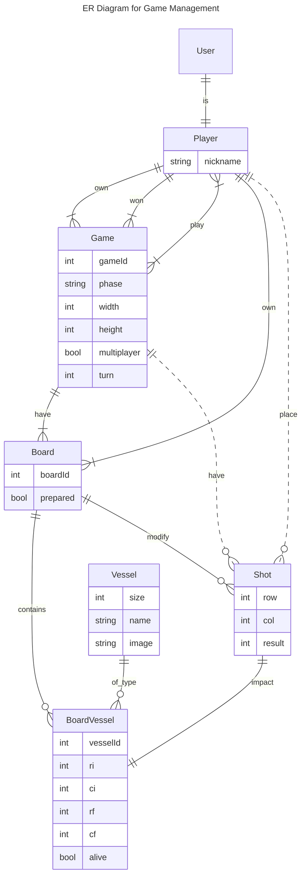

# Session 2

In this session, we will review the basic technologies we will work with during this practice.

## Objectives

- Create a project with [DJango](https://www.djangoproject.com/) [Backend]
- Create a project with [Vue](https://vuejs.org/) [Frontend]
- Review and start up the basic code for the practice

## Introduction to the Backend

We will define the backend using the [DJango](https://www.djangoproject.com/) framework from Python, which allows rapid development of web applications by incorporating modules to add functionalities. In our case, the main modules we will incorporate are:
* [DJango Auth](https://docs.djangoproject.com/en/5.1/topics/auth/): Django's default authentication system. It provides the **User** model, along with authentication and authorization mechanisms.
* [DJango Rest Framework](https://www.django-rest-framework.org/): A framework that easily enables the creation of a Rest API.
* [drf-spectacular](https://drf-spectacular.readthedocs.io/en/latest/): A module that will allow us to automatically generate the API documentation.


### Data Models

An important part of the backend will be the data models we will use to manage all the information. Below we present the ER diagram of the main models we will use in this practice. Model management will be handled using Django's ORM (Object Relational Mapping) system, based on the [Django Model class](https://docs.djangoproject.com/en/5.1/topics/db/models/).
Next, we briefly explain the different models we will use.

* **User:** The [default model in Django](https://docs.djangoproject.com/en/5.1/topics/auth/default/) representing application users. We will see this model in more detail when we discuss authentication.
* **Player:** This model represents a player, allowing us to add additional information to a basic User. It will be linked through a relation.
* **Game:** Represents a game session, to which one or more players can be assigned. It stores the state and data of the game.
* **Board:** Represents a board. It belongs to a game and to a player.
* **Shot:** Stores the shots made by a player in a game.
* **Vessel:** Stores the ships that have been placed on a board.

Note that the ER diagram only shows the main fields, some of which might need to be managed through relationships between entities.



### API

All data management will be done using the RESTful API, following the base structure below (**you can add** additional methods):

| Method | URL                                                 | Description                  |
| ------ | --------------------------------------------------- | ---------------------------- |
| GET    | `/api/v1/players/`                                    | List of players              |
| POST   | `/api/v1/players/`                                    | Create a player              |
| GET    | `/api/v1/players/{id}/`                               | View player information      |
| PUT    | `/api/v1/players/{id}/`                               | Modify player information    |
| PATCH  | `/api/v1/players/{id}/`                               | Modify player information    |
| DELETE | `/api/v1/players/{id}/`                               | Delete a player              |
| GET    | `/api/v1/games/`                                      | List of games                |
| POST   | `/api/v1/games/`                                      | Create a game                |
| GET    | `/api/v1/games/{id}/`                                 | View game information        |
| PUT    | `/api/v1/games/{id}/`                                 | Modify game information      |
| PATCH  | `/api/v1/games/{id}/`                                 | Modify game information      |
| DELETE | `/api/v1/games/{id}/`                                 | Delete a game                |
| GET    | `/api/v1/games/{id}/players/`                         | List of players in a game    |
| POST   | `/api/v1/games/{id}/players/`                         | Add a player to a game       |
| GET    | `/api/v1/games/{gid}/players/{pid}/`                  | View a player's game data    |
| DELETE | `/api/v1/games/{gid}/players/{pid}/`                  | Remove a player from a game  |
| GET    | `/api/v1/games/{gid}/players/{pid}/vessels/`          | View a user's vessels in a game |
| POST   | `/api/v1/games/{gid}/players/{pid}/vessels/`          | Add a vessel for a user and game |
| GET    | `/api/v1/games/{gid}/players/{pid}/vessels/{vid}/`    | View vessel information for a user and game |
| PUT    | `/api/v1/games/{gid}/players/{pid}/vessels/{vid}/`    | Modify a vessel's location for a user and game |
| PATCH  | `/api/v1/games/{gid}/players/{pid}/vessels/{vid}/`    | Modify a vessel's location for a user and game |
| DELETE | `/api/v1/games/{gid}/players/{pid}/vessels/{vid}/`    | Delete a vessel from a user's board for a game |
| GET    | `/api/v1/games/{gid}/players/{pid}/shots/`            | View a player's shots in a game |
| POST   | `/api/v1/games/{gid}/players/{pid}/shots/`            | Make a new shot for a player in a game |
| GET    | `/api/v1/games/{gid}/players/{pid}/shots/{sid}/`      | View shot information for a player and game |
| GET    | `/api/v1/games/{gid}/players/{pid}/boards/`           | View a player's game boards |
| GET    | `/api/v1/games/{gid}/players/{pid}/boards/{bid}/`     | View a player's specific board in a game |

The message bodies and return types should be decided by you and must be documented in the API documentation and the **report**.

**Note:** At this point, the API will allow us to perform all actions regardless of authentication and user permissions. We will address authentication and authorization later.

## Laboratory Tasks

### Exercise 1

Follow the link to **Github Classroom** and download the code for Practice 2.

- [https://classroom.github.com/a/diHjdyim](https://classroom.github.com/a/diHjdyim)

You will find two folders:

- **frontend**: Initial version of the frontend. This code is based on a version similar to that obtained in the previous session's exercises but includes some pre-implemented components.

- **backend**: Initial version of the backend. This code is based on a version similar to that obtained in the previous session's exercises but includes some packages and initial configurations.

Run both codes the same way you did in the previous session.

### Exercise 2

Open the **backend** code and review its structure. Notice that there is a ***api** folder. This is where we want to put all API-related backend parts. In particular, identify the following structure:

| Component        | Purpose                                    |
| ---------------- | ------------------------------------------ |
| `models.py`      | Defines the database schema               |
| `migrations`     | Package where database migrations are created |
| `serializers.py` | Translates models <-> JSON data            |
| `views.py`       | Defines the views implementing the API logic |
| `urls.py`        | Maps API routes to views                  |
| `signals.py`     | Registers signals/events                 |

### Exercise 3

The first thing we want to do is define the **Player** and **Game** models as represented in the previous data model. To do this, open the `models.py` file inside the **api** folder and add the following content:

```python
from django.db import models
from django.contrib.auth.models import User
from django.core.validators import MinValueValidator, MaxValueValidator

class Player(models.Model):
    user = models.OneToOneField(User, on_delete=models.CASCADE)
    nickname = models.CharField(max_length=50)

class Game(models.Model):
    PHASE_WAITING = "waiting"
    PHASE_PLACEMENT = "placement"
    PHASE_PLAYING = "playing"
    PHASE_GAMEOVER = "gameOver"
    PHASE_CHOICES = {
        PHASE_WAITING: "Waiting",
        PHASE_PLACEMENT: "Placement",
        PHASE_PLAYING: "Playing",
        PHASE_GAMEOVER: "Game Over",
    }

    players = models.ManyToManyField(Player, related_name="games")
    width = models.IntegerField(validators=[MinValueValidator(5), MaxValueValidator(200)], default=10)
    height = models.IntegerField(validators=[MinValueValidator(5), MaxValueValidator(200)], default=10)
    multiplayer = models.BooleanField(default=False)
    turn = models.ForeignKey(Player, related_name="turn", on_delete=models.SET_NULL, blank=True, null=True)
    phase = models.CharField(max_length=15, choices=PHASE_CHOICES.items(), default=PHASE_WAITING)
    winner = models.ForeignKey(Player, related_name="winner", on_delete=models.SET_NULL, blank=True, null=True)
    owner = models.ForeignKey(Player, related_name="owner", on_delete=models.SET_NULL, null=True)
```

Now generate a new migration to update the database:

```bash
poetry run python manage.py makemigrations
```

Check the **migrations** folder to ensure a new migration has been generated, and verify that two new models are being created.

Finally, apply the migration to the database:

```bash
poetry run python manage.py migrate
```

**Note:** At this point, you should already have the SQLite database file created. Try to view it to ensure that all tables have been created.

If you look at the models, we have defined a player (Player) with a one-to-one relation with a user (User). To ensure that each time a new user is created, a player record is also created, we will use **signals**.

Open the `signals.py` file and add the following content (create the file if it does not exist):

```python
from django.db.models.signals import post_save
from django.contrib.auth.models import User
from django.dispatch import receiver
from .models import Player

@receiver(post_save, sender=User)
def create_player(sender, instance, created, **kwargs):
    if created:
        Player.objects.create(user=instance, nickname=instance.username)
```

Now, register this signal in our application. Open the `apps.py` file and add:

```python
class ApiConfig(AppConfig):
    default_auto_field = 'django.db.models.BigAutoField'
    name = 'battleship.api'

    def ready(self):
        import battleship.api.signals
```

From now on, every time a new user is created, a player record will be automatically created.

### Exercise 4

Once we have the models, we need to define their serializers. This will allow us to move between JSON and model instances. Add the following code to `serializers.py`:

```python
from rest_framework import serializers
from .models import Player, Game

class PlayerSerializer(serializers.ModelSerializer):
    class Meta:
        model = Player
        fields = '__all__'

class GameSerializer(serializers.ModelSerializer):
    owner = serializers.ReadOnlyField(source='owner.user.username')

    class Meta:
        model = Game
        fields = '__all__'
```

### Exercise 5

Now we want to add the methods to interact with these models via API.

Add the following to `views.py`:

```python
from rest_framework import viewsets, filters, status
from rest_framework.decorators import action
from rest_framework.response import Response
from django.shortcuts import get_object_or_404

from .models import Player, Game
from .serializers import PlayerSerializer, GameSerializer

class PlayerViewSet(viewsets.ModelViewSet):
    queryset = Player.objects.all()
    serializer_class = PlayerSerializer
    filter_backends = [filters.SearchFilter]
    search_fields = ['nickname']

class GameViewSet(viewsets.ModelViewSet):
    queryset = Game.objects.all()
    serializer_class = GameSerializer    
    filter_backends = [filters.SearchFilter, filters.OrderingFilter]
    search_fields = ['phase']
    ordering_fields = ['id']

    def perform_create(self, serializer):
        player = get_object_or_404(models.Player, user=User.objects.first())
        serializer.save(owner=player)
```

### Exercise 6

The last step is to map these new views to their corresponding URLs. Add the following to `urls.py`:

```python
from django.urls import path, include
from rest_framework.routers import DefaultRouter
from .views import PlayerViewSet, GameViewSet

router = DefaultRouter()
router.register(r'players', PlayerViewSet)
router.register(r'games', GameViewSet)

urlpatterns = [
    path('', include(router.urls)),
]
```

For nested resources (e.g., players inside games), you must use a nested router. Follow the example from [this guide](https://medium.com/@sunilnepali844/nested-routers-in-django-rest-framework-7d6a5a1cc8f0), keeping in mind that the necessary packages are already installed in the provided code.

## Tasks outside the laboratory

### Exercise 7

Create the models for the remaining entities from the ER diagram.

### Exercise 8

Define the serializers and views to manage the models.
