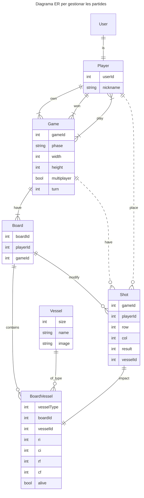

# Sessió 1

En aquesta sessió veurem les tecnologíes bàsiques amb les que treballarem durant aquesta pràctica.

## Objectius

- Creació d'un projecte amb [DJango](https://www.djangoproject.com/) [Backend]
- Creació d'un projecte amb [Vue](https://vuejs.org/) [Frontend]
- Revisió i posada en marxa del codi bàsic de la pràctica

## Introducció al Backend

El backend el definirem amb el framework [DJango](https://www.djangoproject.com/) de Python, el qual ens permet el
desenvolupament ràpid d'aplicacions web, incorporant mòduls per afegir funcionalitats. En el nostre cas, els principals
mòduls que incorporarem seran:
* [DJango Auth](https://docs.djangoproject.com/en/5.1/topics/auth/): És el sistema d'autenticació per defecte de DJango. Ens proporciona el model de l'usuari **User**, a més de mecanismes d'autenticació i autorització.
* [DJango Rest Framework](https://www.django-rest-framework.org/): És un framework que permet crear de forma fàcil una API Rest.
* [drf-spectacular](https://drf-spectacular.readthedocs.io/en/latest/): És un mòdul que ens permetrà generar automàticament l'ajuda de l'API.


### Models de dades

Una part important del backend seran els models de dades que utilitzarem per gestionar tota la informació. A continuació us presentem
el diagrama ER dels principals models que utilitzarem en aquesta pràctica. La gestió dels models el farem utilitzant
el sistema ORM (Object Relational mapping) de Django, basats en la classe [Model de DJango](https://docs.djangoproject.com/en/5.1/topics/db/models/). 
A continuació us expliquem breument els diferents models que utilitzarem. 

* **User:** És el [model que DJango](https://docs.djangoproject.com/en/5.1/topics/auth/default/) utilitza per representar els usuaris de l'aplicació. Veurem aquest model amb més detall quan parlem d'autenticació.
* **Player:** Aquest model representa un jugador, i ens permet afegir informació addicional a la bàsica d'un Usuari. Quedarà vinculada amb una relació 
* **Game:** És una partida, a la qual podrem assignar un o més jugadors. Guardarà l'estat i les dades de la partida.
* **Board:** Representa un tauler. Pertany a una partida i a un jugador.
* **Shot:** Guarda les tirades d'un jugador a una partida.
* **Vessel:** Guarda els vaixells que s'han ubicat a un tauler (Board).

Cal tenir en compte que el diagrama ER mostra només els camps principals, alguns dels quals pot ser que calgui gestionar-los via relacions entre les entitats.



# Step by step guide

## 🧱 Step 1: Define Your Models
Inside `models.py`:

```python
from django.db import models
from django.contrib.auth.models import User
from django.core.validators import MinValueValidator, MaxValueValidator

class Player(models.Model):
    user = models.OneToOneField(User, on_delete=models.CASCADE)
    nickname = models.CharField(max_length=50)

class Game(models.Model):
    PHASE_WAITING = "waiting"
    PHASE_PLACEMENT = "placement"
    PHASE_PLAYING = "playing"
    PHASE_GAMEOVER = "gameOver"
    PHASE_CHOICES = {
        PHASE_WAITING: "Waiting",
        PHASE_PLACEMENT: "Placement",
        PHASE_PLAYING: "Playing",
        PHASE_GAMEOVER: "Game Over",
    }

    players = models.ManyToManyField(Player, related_name="games")
    width = models.IntegerField(validators=[MinValueValidator(5), MaxValueValidator(200)], default=10)
    height = models.IntegerField(validators=[MinValueValidator(5), MaxValueValidator(200)], default=10)
    multiplayer = models.BooleanField(default=False)
    turn = models.ForeignKey(Player, related_name="turn", on_delete=models.SET_NULL, blank=True, null=True)
    phase = models.CharField(max_length=15, choices=PHASE_CHOICES.items(), default=PHASE_WAITING)
    winner = models.ForeignKey(Player, related_name="winner", on_delete=models.SET_NULL, blank=True, null=True)
    owner = models.ForeignKey(Player, related_name="owner", on_delete=models.SET_NULL, null=False)
```
🧠 Learn more: [Django Models](https://docs.djangoproject.com/en/stable/topics/db/models/)

## 🛠️ Step 2: Create Serializers

In `serializers.py`:

```python
from rest_framework import serializers
from .models import Player, Game

class PlayerSerializer(serializers.ModelSerializer):
    class Meta:
        model = Player
        fields = '__all__'

class GameSerializer(serializers.ModelSerializer):
    owner = serializers.ReadOnlyField(source='owner.user.username')

    class Meta:
        model = Game
        fields = '__all__'
```

📚 Learn more: [DRF Serializers](https://www.django-rest-framework.org/api-guide/serializers/)

## 🔐 Step 3: Custom Permissions

Create `permissions.py`:

```python
from rest_framework import permissions

class IsOwnerOrReadOnly(permissions.BasePermission):
    def has_object_permission(self, request, view, obj):
        if request.method in permissions.SAFE_METHODS:
            return True
        return obj.owner.user == request.user
```

## 🔧 Step 4: Views with Custom Actions

In views.py:

```python
from rest_framework import viewsets, permissions, filters, status
from rest_framework.decorators import action
from rest_framework.response import Response
from django.shortcuts import get_object_or_404

from .models import Player, Game
from .serializers import PlayerSerializer, GameSerializer
from .permissions import IsOwnerOrReadOnly

class PlayerViewSet(viewsets.ModelViewSet):
    queryset = Player.objects.all()
    serializer_class = PlayerSerializer
    filter_backends = [filters.SearchFilter]
    search_fields = ['nickname']

class GameViewSet(viewsets.ModelViewSet):
    queryset = Game.objects.all()
    serializer_class = GameSerializer
    permission_classes = [permissions.IsAuthenticatedOrReadOnly, IsOwnerOrReadOnly]
    filter_backends = [filters.SearchFilter, filters.OrderingFilter]
    search_fields = ['phase']
    ordering_fields = ['id']

    def perform_create(self, serializer):
        player = get_object_or_404(Player, user=self.request.user)
        serializer.save(owner=player)

    @action(detail=True, methods=['post'])
    def join(self, request, pk=None):
        game = self.get_object()
        player = get_object_or_404(Player, user=request.user)
        if game.players.filter(id=player.id).exists():
            return Response({'detail': 'Already joined.'}, status=status.HTTP_400_BAD_REQUEST)
        game.players.add(player)
        return Response({'detail': 'Joined game.'})

    @action(detail=True, methods=['post'])
    def start(self, request, pk=None):
        game = self.get_object()
        player = get_object_or_404(Player, user=request.user)
        if game.owner != player:
            return Response({'detail': 'Only the owner can start the game.'}, status=status.HTTP_403_FORBIDDEN)
        game.phase = Game.PHASE_PLACEMENT
        game.save()
        return Response({'detail': 'Game started!'})
```
📚 Learn more: [DRF ViewSets](https://www.django-rest-framework.org/api-guide/viewsets/)

## 🧭 Step 5: URLs and Routing
In `urls.py` (API app-level):

```python
from django.urls import path, include
from rest_framework.routers import DefaultRouter
from .views import PlayerViewSet, GameViewSet

router = DefaultRouter()
router.register(r'player', PlayerViewSet)
router.register(r'game', GameViewSet)

urlpatterns = [
    path('', include(router.urls)),
]
```

📚 Learn more: [DRF Routers](https://www.django-rest-framework.org/api-guide/routers/)

## 🧙 Step 6: Automatically Create Player on User Signup

In `signals.py` (create it if it doesn’t exist):

```python
from django.db.models.signals import post_save
from django.contrib.auth.models import User
from django.dispatch import receiver
from .models import Player

@receiver(post_save, sender=User)
def create_player(sender, instance, created, **kwargs):
    if created:
        Player.objects.create(user=instance, nickname=instance.username)
```

Register the signal in `apps.py`:

```python
from django.apps import AppConfig


class ApiConfig(AppConfig):
    default_auto_field = 'django.db.models.BigAutoField'
    name = 'battleship.api'

    def ready(self):
        import battleship.api.signals
```

📚 Learn more: [Django Signals](https://docs.djangoproject.com/en/stable/topics/signals/)

## ⚙️ Step 7: DRF Settings (Optional but Recommended)
In settings.py:

```python
REST_FRAMEWORK = {
    'DEFAULT_PAGINATION_CLASS': 'rest_framework.pagination.LimitOffsetPagination',
    'PAGE_SIZE': 10,
    'DEFAULT_PERMISSION_CLASSES': [
        'rest_framework.permissions.IsAuthenticatedOrReadOnly',
    ],
    'DEFAULT_FILTER_BACKENDS': [
        'rest_framework.filters.SearchFilter',
        'rest_framework.filters.OrderingFilter',
    ]
}
```

## ✅ Endpoints Summary

| Method | Endpoint | Description |
|--------|----------|-------------|
|GET  |	/api/players/|	List all players|
|POST |	/api/games/	| Create a game (auto set owner)|
|POST |	/api/games/{id}/join/ | Join a game|
|POST |	/api/games/{id}/start/ | Start a game|

## 🧪 Final Steps

```bash
poetry run python manage.py makemigrations
poetry run python manage.py migrate
poetry run python manage.py createsuperuser
poetry run python manage.py runserver
```
