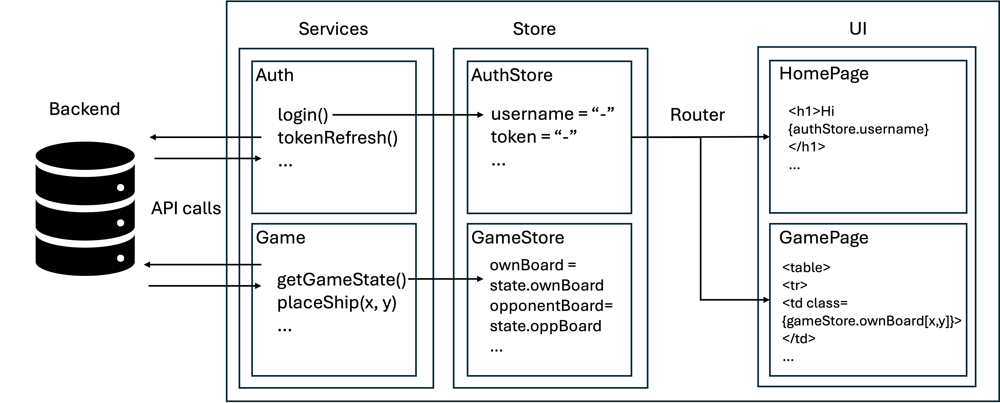
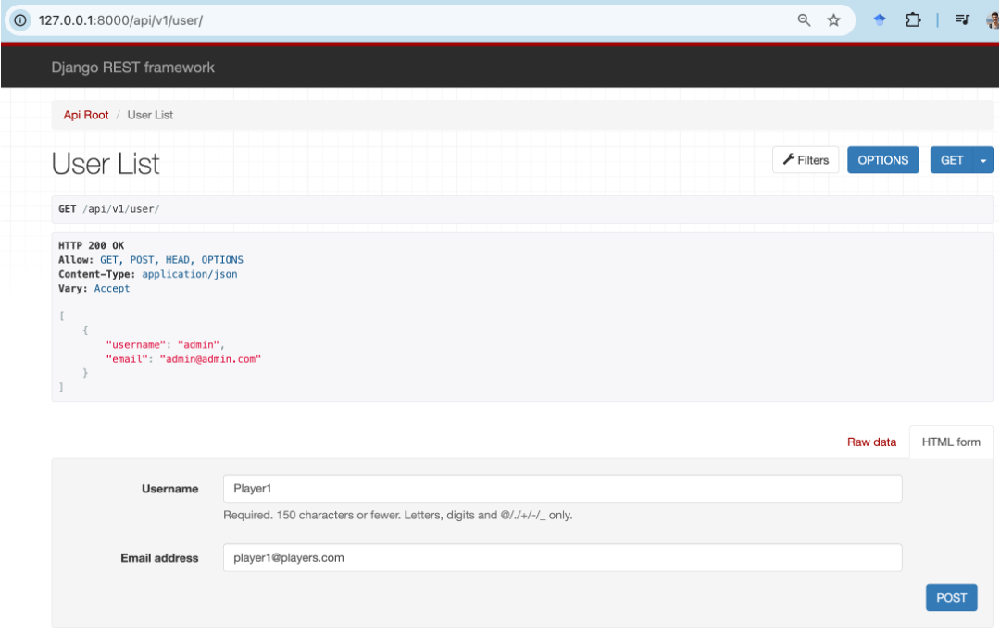
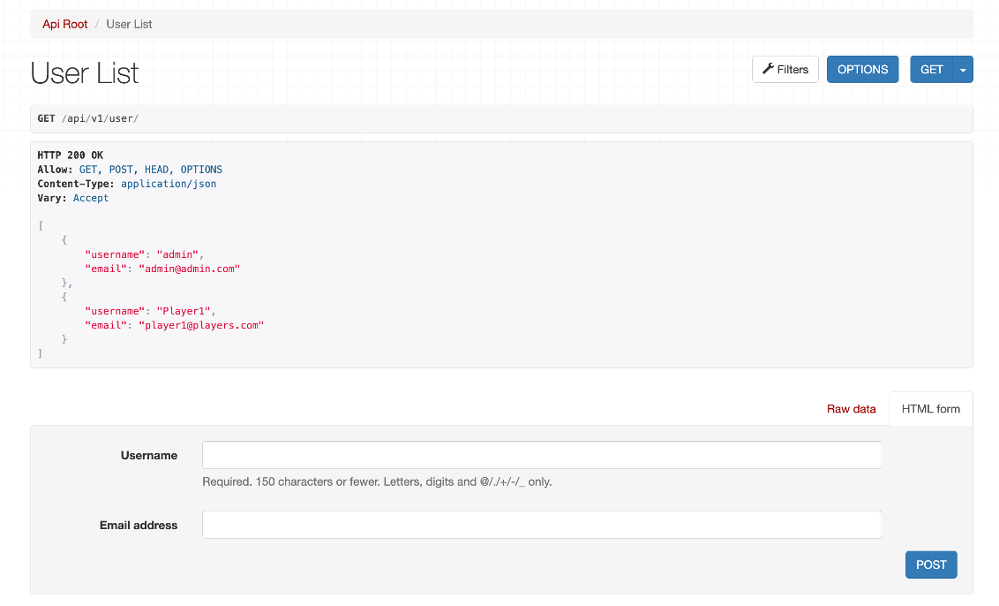
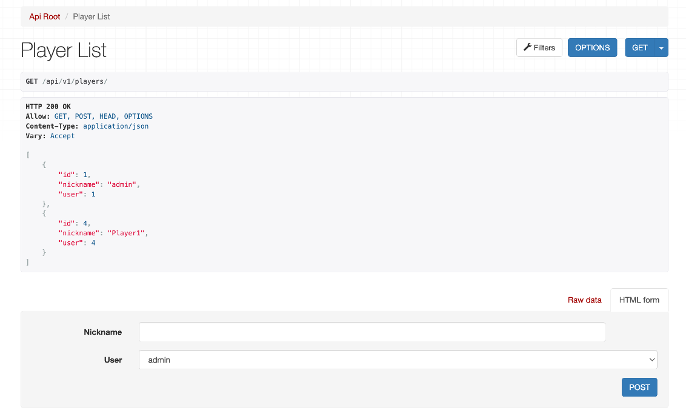
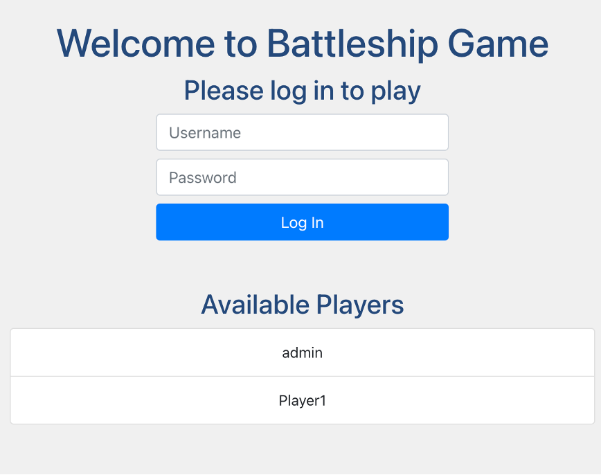

# Sessió 3

## Objectius

- Entendre l'estructura del Frontend
- Aprendre a connectar el frontend amb el backend mitjançant l'API

## Introducció al Frontend

Definirem el frontend utilitzant Vue i l'eina de construcció Vite amb npm (Node Package Manager), que és una eina fonamental per al desenvolupament en JavaScript, actuant com a gestor de paquets. Al repositori de la [Pràctica 2](https://github.com/SoftwareDistribuitUB-2025/PR2), trobareu el codi inicial per al frontend que ja conté la lògica del joc, la interfície d'usuari i la interacció amb l'usuari. Durant aquesta sessió veurem com connectar el frontend amb el backend, consumint l'API implementada al backend.

L'estructura del projecte frontend és la següent (pots saltar-te aquesta part ara i fer-la servir com a referència més endavant):

```bash
.
├── README.md
├── env_sample -> Variables d'entorn
├── index.html -> Fitxer HTML principal o punt d'entrada
├── jsconfig.json -> Fitxer de configuració de JavaScript
├── node_modules -> Directori que conté totes les dependències instal·lades via npm
├── package-lock.json -> Fitxer generat automàticament que fixa les versions de les dependències
├── package.json -> Fitxer que conté les metadades del projecte i les dependències
├── public -> Directori que conté actius estàtics que es serviran directament
├── src -> Directori del codi font
│   ├── App.vue -> Component principal de Vue
│   ├── assets -> Directori que conté recursos estàtics
│   │   ├── SeaWarfareSet -> Directori que conté les imatges del joc
│   │   ├── base.css -> Fitxer CSS base que defineix els estils bàsics de l'aplicació
│   │   └── main.css -> Fitxer CSS principal que defineix els estils per al joc de vaixells
│   ├── components -> Directori que conté components Vue reutilitzables
│   │   ├── DockingArea.vue -> Component per a la zona d’atracament (visible només en la fase de col·locació)
│   │   ├── GameBoard.vue -> Component per al tauler de joc
│   │   ├── Header.vue -> Component per a la capçalera (nom de l’usuari i botó de tancar sessió)
│   │   └── assetHelper.js -> Funcions auxiliars per als recursos (camins d’imatges dels vaixells)
│   ├── main.js -> Fitxer JavaScript principal que inicialitza l’aplicació Vue
│   ├── router
│   │   └── index.js -> Fitxer que defineix les rutes de l’aplicació (URL com ara /game, /, etc.)
│   ├── services -> Capa de serveis que utilitza la llibreria axios per fer crides a l’API del backend
│   │   ├── api.js -> Fitxer que defineix les funcions de l’API per interactuar amb el backend
│   │   └── auth.js -> Fitxer que defineix les funcions d’autenticació
│   ├── store -> Directori que conté el magatzem pinia (llibreria de gestió d’estat)
│   │   ├── authStore.js -> Magatzem per a l’estat d’autenticació
│   │   └── index.js -> Magatzem per a l’estat del joc (tauler, vaixells, etc.)
│   └── views
│       ├── Game.vue -> Vista per al joc (tauler, vaixells, etc. després d’iniciar sessió)
│       └── Home.vue -> Vista per a la pàgina inicial (pàgina d’inici de sessió)
└── vite.config.js -> Fitxer de configuració de Vite
```



### Com executar el frontend

1. Copia el fitxer env_sample a .env
2. Instal·la les dependències utilitzant npm:

```bash
npm install
```

3. Executa el servidor de desenvolupament:

```bash
npm run dev
```

4. Obre el navegador i ves a l'adreça `http://localhost:5173/` per veure l'aplicació en funcionament.

## Exercici 1: Preparació del backend

En aquest exercici, utilitzarem la llibreria `axios` per fer la primera crida a l'API del backend. Tal com hem vist a la [sessió anterior](./Sessio_2.md), la plantilla proporcionada de Django utilitza el model d'autenticació `Django Auth`. Pots veure-ho a la documentació generada per `drf-spectacular` a l’URL `http://localhost:8000/docs/` del backend (cal executar el backend seguint els passos de la sessió anterior). L’endpoint per obtenir la llista de tots els usuaris és `GET /api/v1/user/`. Primer crearem aquest endpoint al backend. Per fer-ho, fes els següents canvis als fitxers corresponents:

1. Afegeix a `serializers.py`

```python
from django.contrib.auth.models import User

class UserSerializer(serializers.ModelSerializer):
    class Meta:
        model = User
        fields = ['username', 'email']
```

2. Afegeix a `views.py`

```python
from .serializers import PlayerSerializer, GameSerializer, UserSerializer
from django.contrib.auth.models import User

class UserViewSet(viewsets.ModelViewSet):
    queryset = User.objects.all()
    serializer_class = UserSerializer
    filter_backends = [filters.SearchFilter]
    search_fields = ['username', 'email']
```

3. Afegeix a `urls.py``

```python
router.register(r'user', UserViewSet)
```

4. Comprova que l’endpoint funciona obrint l'adreça `http://localhost:8000/api/v1/user/` al navegador. Hauries de veure una llista de tots els usuaris.

   **NOTA:** potser necessitaràs crear alguns usuaris al panell d’administració de Django o utilitzant la shell de Django. Pots crear un superusuari amb la comanda següent:

   ```bash
   python manage.py createsuperuser
   ```

5. Tal com està configurat actualment, l’endpoint està protegit i només és accessible per usuaris autenticats. Donat que l’autenticació no la veurem fins a la següent sessió, la podeu desactivar a la configuració del backend. Per fer-ho, comenta les línies a `settings.py` que defineixen les classes d’autenticació:

```python
REST_FRAMEWORK = {
    # Use Django's standard `django.contrib.auth` permissions,
    # or allow read-only access for unauthenticated users.
    'DEFAULT_PERMISSION_CLASSES': [
        # 'rest_framework.permissions.DjangoModelPermissionsOrAnonReadOnly'
        #'rest_framework.permissions.IsAuthenticated',
    ],
    'DEFAULT_AUTHENTICATION_CLASSES': (
        #'rest_framework.authentication.BasicAuthentication',
        #'rest_framework.authentication.SessionAuthentication',
        # 'rest_framework_simplejwt.authentication.JWTAuthentication',
    ),
    'DEFAULT_SCHEMA_CLASS': 'drf_spectacular.openapi.AutoSchema',
}
```

6. Ara, crearem un nou usuari des del navegador. Ves a `http://localhost:8000/api/v1/user/` i afegeix un nou usuari utilitzant el mètode `POST`, com es mostra a la següent imatge.
   

7. Hauries de veure un resultat com aquest:
   

8. Recordeu que en la sessió anterior haviem definit un esdeveniment al fitxer `signals.py` del backend, que creava un objecte `Player` cada cop que s'afegia un nou usuari. Això es fa per establir la relació entre els models `User` i `Player`. Pots comprovar que està funcionant accedint a `http://localhost:8000/api/v1/players/` que el nou usuari s’ha creat correctament.
   

## Exercici 2: Crida a l’API des del frontend per obtenir la llista de jugadors

1. Els **serveis** són una manera de separar les crides a l’API dels components. Això es fa per mantenir els components nets i enfocats a la interfície d’usuari. Dins del directori `services`, hem separat les crides a l’API en dos fitxers: `api.js` i `auth.js`. El fitxer `api.js` conté crides a l’API relacionades amb el joc, com ara la col·locació dels vaixells, l’atac al tauler de l’oponent, etc., mentre que el servei `auth.js` conté les crides relacionades amb l’autenticació, com ara iniciar sessió, tancar sessió i actualitzar el token.

Afegiu el mètode `getAllPlayers()` al servei `auth.js`, dins de la classe `AuthService`:

```javascript
  getAllPlayers() {
    return this.getAxiosInstance().get("/api/v1/players/");
  }
```

En aquest codi estem utilitzant el mètode `getAxiosInstance()`, que definirem a la següent sessió, per incloure el token d’autenticació a les capçaleres de la sol·licitud. Aquest mètode s’utilitzarà en totes les crides a l’API que requereixin autenticació.

Després, fem servir el mètode `get()` de la instància `axios` per fer una crida `GET` a l’endpoint `/api/v1/players/`. Cal tenir en compte que aquesta URL és relativa a la base URL definida a la instància `axios`. Això s’ha fet per evitar codificar la URL base a cada crida. Aquesta URL base indica en quina URL es troba el backend, i és un paràmetre del nostre frontend. El seu valor el definirem en el fitxer `.env` i s'accedei en el fitxer `App.vue`.

2. L’**Store** és una manera de gestionar l’estat de l’aplicació. En aquest cas, utilitzarem `pinia` com a llibreria de gestió d’estat. L’**store** es farà servir per gestionar l’estat del joc i la informació de l’usuari. Igual que amb els serveis, separarem l’**store** en dos fitxers: `authStore.js` i `store/index.js`. El fitxer `authStore.js` conté l’estat relacionat amb l’autenticació, com la informació de l’usuari, mentre que `store/index.js` conté l’estat relacionat amb el joc, com el tauler, els vaixells, etc.

   Totes les crides a l’API es faran des de l’**store**, i les variables d’estat corresponents s’actualitzaran. Per exemple, quan es fa un tret, l’**store** farà una crida a l’API per actualitzar el tauler i els vaixells. Llavors, l’**store** actualitzarà les variables d’estat i els components reaccionaran als canvis. Això es fa per mantenir els components nets i enfocats en la interfície d’usuari.

   Afegim ara el mètode `getAllPlayers()` al fitxer `authStore.js`, dins de l’**store** `authStore`, que utilitza el mètode anterior amb el mateix nom:

   ```javascript
   state: () => ({
       username: null,
       accessToken: null,
       refreshToken: null,
       isAuthenticated: false,
       loading: false,
       error: null,
       playersList: [],  // <- Afegeix aquesta línia
     }),
   ```

llavors, dins de l'apartat `actions`:

```javascript
async getAllPlayers() {
      try {
        const response = await AuthService.getAllPlayers();
        for (const player of response.data) {
          this.playersList.push({
            id: player.id,
            nickname: player.nickname,
          });
        }
      } catch (error) {
        const message = error.response?.data?.detail || error.message;
        throw new Error(message);
      }
    },
```

3. Els **components** són les peces fonamentals de l’aplicació **frontend**. Ja tens la lògica del joc i la interfície d’usuari implementades, però actualment, les crides a l’API estan simulades al fitxer `services/api.js`. Ara modificarem el component `Home.vue` per visualitzar la llista de jugadors:

```javascript
onMounted(() => {
  authStore.initializeAuthStore();
  authStore.getAllPlayers(); // <- actualitza l'estat de playersList al principi
});
```

Ara afegirem el codi següent a la secció `template` del component `Home.vue` per visualitzar la llista de jugadors:

```html
<div v-if="authStore.playersList.length > 0" class="mt-5">
  <h3>Jugadors disponibles</h3>
  <ul class="list-group">
    <li
      v-for="player in authStore.playersList"
      :key="player.id"
      class="list-group-item"
    >
      {{ player.nickname }}
    </li>
  </ul>
</div>
```

Tingues en compte que estem accedint directament a la variable d’estat `playersList` des de l’**store** `authStore`. Això es fa per evitar passar la variable d’estat com a **prop** al component. La directiva `v-if` s’utilitza per comprovar si l’array `playersList` no està buit abans de renderitzar la llista.

4. **Executa el frontend** i comprova que la llista de jugadors es mostri a la pàgina inicial. Hauries de veure alguna cosa com aquesta:
   

## Treball fora del laboratori

- Consulta la representació del tauler que es mostra a `frontend/README.md` a la plantilla inicial de la PR2.

- A mesura que avancis en la implementació de l’API del backend per a la jugabilitat, substitueix les crides simulades a l’API al fitxer `services/api.js` per les crides reals al backend. Això et permetrà provar conjuntament les crides a l’API i la lògica del joc.

  Per exemple, el mètode `getGameState()` al fitxer `api.js` està programat per retornar un estat de joc simulat. Hauràs de substituir-lo per la crida real a l’API del backend per obtenir l’estat del joc:

```javascript
  getGameState(gameId) {
    return Promise.resolve(
      JSON.stringify({
        status: 200,
        message: "OK",
        data: {
          gameState: {
            gameId: "12345",
            phase: "playing", // "placement", "playing", "gameOver"
            turn: "player1",
            winner: null,
            player1: {
              id: "1",
              username: "admin",
              placedShips: [
                {
                  type: 1,
                  position: { row: 1, col: 3 },
                  isVertical: true,
                  size: 1,
                },
                {
                  type: 2,
                  position: { row: 3, col: 4 },
                  isVertical: false,
                  size: 2,
                },
                {
                  type: 3,
                  position: { row: 5, col: 2 },
                  isVertical: true,
                  size: 3,
                },
                {
                  type: 4,
                  position: { row: 6, col: 7 },
                  isVertical: false,
                  size: 4,
                },
                {
                  type: 5,
                  position: { row: 1, col: 8 },
                  isVertical: true,
                  size: 5,
                },
              ],
              availableShips: [],
              board: [
                [0, 0, 0, 0, 0, 0, 0, 0, 0, 0],
                [0, 11, 0, 1, 0, 0, 0, 0, 5, 0],
                [0, 0, 0, 0, 0, 0, 0, 0, 5, 0],
                [0, 0, 0, 2, 2, 0, 0, 0, 5, 0],
                [0, 0, 0, 0, 0, 0, 0, 0, 5, 0],
                [0, 0, -3, 0, 0, 0, 0, 0, 5, 0],
                [0, 0, 3, 0, 4, -4, 4, 4, 0, 0],
                [0, 0, 3, 0, 0, 0, 0, 0, 0, 0],
                [0, 0, 0, 0, 0, 0, 0, 11, 0, 0],
                [0, 0, 0, 0, 0, 0, 0, 0, 0, 0],
              ],
            },
            player2: {
              id: "2",
              username: "player2",
              placedShips: [
                {
                  type: 1,
                  position: { row: 1, col: 3 },
                  isVertical: true,
                  size: 1,
                },
                {
                  type: 2,
                  position: { row: 3, col: 4 },
                  isVertical: false,
                  size: 2,
                },
                {
                  type: 3,
                  position: { row: 5, col: 2 },
                  isVertical: true,
                  size: 3,
                },
                {
                  type: 4,
                  position: { row: 6, col: 7 },
                  isVertical: false,
                  size: 4,
                },
                {
                  type: 5,
                  position: { row: 1, col: 8 },
                  isVertical: true,
                  size: 5,
                },
              ],
              availableShips: [],
              board: [
                [0, 0, 0, 0, 0, 0, 0, 0, 0, 0],
                [0, 11, 0, 1, 0, 0, 0, 0, 5, 0],
                [0, 0, 0, 0, 0, 0, 0, 0, 5, 0],
                [0, 0, 0, 2, 2, 0, 0, 0, 5, 0],
                [0, 0, 0, 0, 0, 0, 0, 0, 5, 0],
                [0, 0, -3, 0, 0, 0, 0, 0, 5, 0],
                [0, 0, 3, 0, 4, -4, 4, 4, 0, 0],
                [0, 0, 3, 0, 0, 0, 0, 0, 0, 0],
                [0, 0, 0, 0, 0, 0, 0, 11, 0, 0],
                [0, 0, 0, 0, 0, 0, 0, 0, 0, 0],
              ],
            },
          },
        },
      })
    );
  },
```

Per provar aquesta crida simulada a l'API, mira el component `Game.vue` i fes els canvis necessaris.

```javascript
onMounted(() => {
  // To start the app with a new game, uncomment the line below
  // store.startNewGame();
  // To start the app from an existing game, uncomment the line below
  store.getGameState();
});
```
