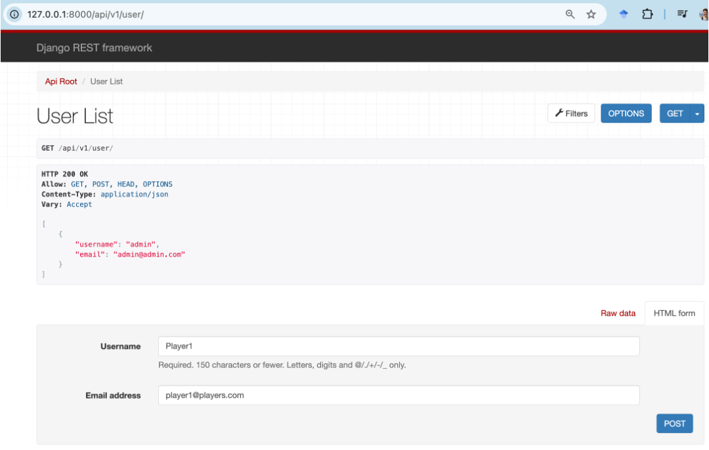
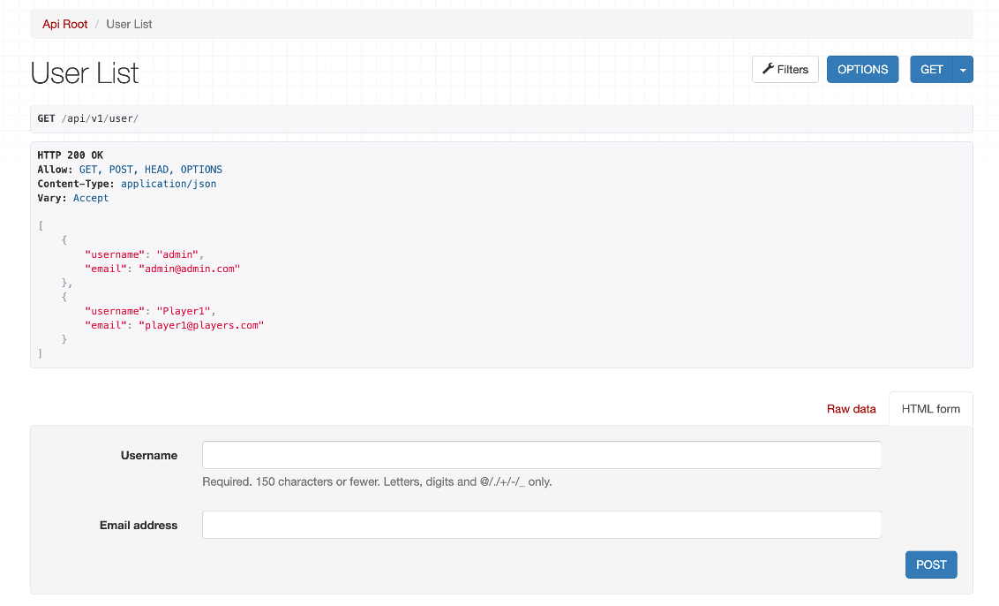
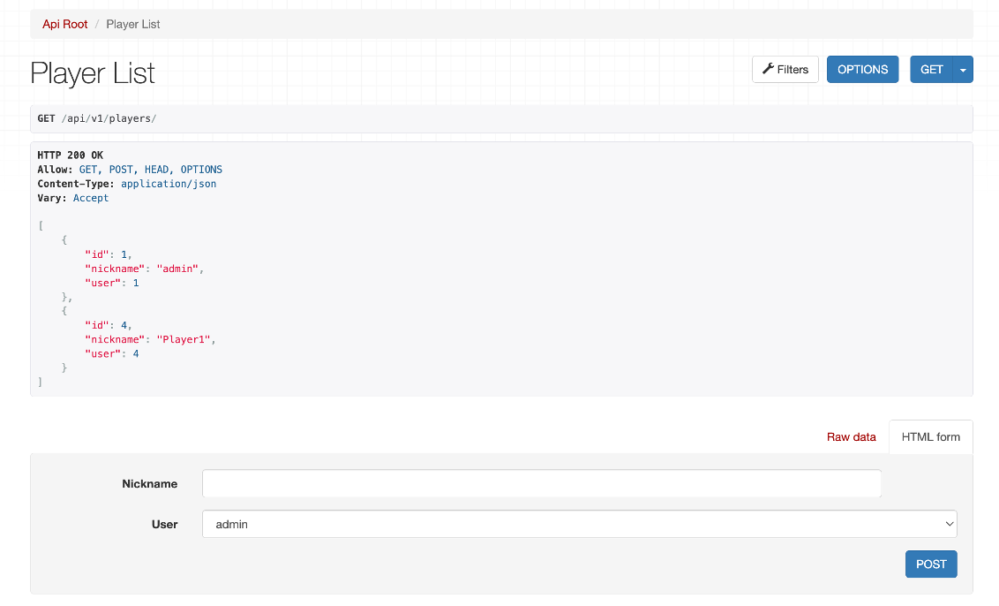

# Session 3

## Objectives

- Understand the Frontend structure
- Learn how to connect the frontend with the backend API

## Introduction to the Frontend

We will define the frontend using Vue and Vite build tool with npm (Node Package Manager) which is a crucial tool for JavaScript development acting as a package manager. In the [PR2](https://github.com/SoftwareDistribuitUB-2025/PR2) repo, we will find the initial code for the frontend that already contains the game logic, user interface, and the user interaction. Throughout the pracice for the frontend, we will consume the API that we are creating in the backend.

The structure of the frontend project is as follows (you can skip this part now and use it as a reference later):

```bash
.
├── README.md
├── env_sample -> Environment variables
├── index.html -> Main HTML file or entry point
├── jsconfig.json -> JavaScript configuration file
├── node_modules -> Directory containing all the dependencies installed via npm
├── package-lock.json -> Automatically generated file that locks the versions of the dependencies
├── package.json -> File that contains the metadata of the project and the dependencies
├── public -> Directory containing static assets that will be served directly
├── src -> Source code directory
│   ├── App.vue -> Main Vue component
│   ├── assets -> Directory containing static assets
│   │   ├── SeaWarfareSet -> Directory containing the images of the game
│   │   ├── base.css -> Base CSS file defining the basic styles for the application
│   │   └── main.css -> Main CSS file defining the styles for the battleship game
│   ├── components -> Directory containing reusable Vue components
│   │   ├── DockingArea.vue -> Component for the docking area (visible only in the placement phase)
│   │   ├── GameBoard.vue -> Component for the game board
│   │   ├── Header.vue -> Component for the header (name of the user and logout button)
│   │   └── assetHelper.js -> Helper functions for the assets (ship image paths)
│   ├── main.js -> Main JavaScript file that initializes the Vue application
│   ├── router
│   │   └── index.js -> File that defines the routes of the application (urls such as /game, /, etc.)
│   ├── services -> Service layer that uses the axios library to make API calls to the backend
│   │   ├── api.js -> File that defines the API functions to interact with the backend
│   │   └── auth.js -> File that defines the authentication functions
│   ├── store -> Directory containing the pinia store (state management library)
│   │   ├── authStore.js -> store for the authentication state
│   │   └── index.js -> store for the game state (board, ships, etc.)
│   └── views
│       ├── Game.vue -> View for the game (game board, ships, etc. after login)
│       └── Home.vue -> View for the home page (login page)
└── vite.config.js -> Vite configuration file
```


### How to run the frontend

1. Copy the `env_sample` file to `.env`
2. Install the dependencies using npm:
   ```bash
   npm install
   ```
3. Run the development server:
   ```bash
   npm run dev
   ```
4. Open your browser and go to `http://localhost:5173/` to see the application running.

## Exercise 1: Preparation of the backend

In this exercise, we will use the `axios` library to make the firts API call to the Django backend. As we have seen in the previous session, the provided Django template uses `Django Auth` model. You can see it in the documentation generated by `drf-spectacular` in the `localhost:8000/docs/` URL after running the backend. The endpoint to get the list of all users is `GET /api/v1/user/`. Let's first create this API endpoint in the backend. To do this, make the following changes in the corresponding files:

1. Add in `serializers.py`

```python
from django.contrib.auth.models import User

class UserSerializer(serializers.ModelSerializer):
    class Meta:
        model = User
        fields = ['username', 'email']
```

2. Add in `views.py`

```python
from .serializers import PlayerSerializer, GameSerializer, UserSerializer
from django.contrib.auth.models import User

class UserViewSet(viewsets.ModelViewSet):
    queryset = User.objects.all()
    serializer_class = UserSerializer
    filter_backends = [filters.SearchFilter]
    search_fields = ['username', 'email']
```

3. Add in `urls.py`

```python
router.register(r'user', UserViewSet)
```

4. Check that the endpoint is working by going to `localhost:8000/api/v1/user/` in your browser. You should see a list of all users. NOTE: you may need to create some users in the Django admin panel or using the Django shell. You can create a superuser using the following command:

```bash
python manage.py createsuperuser
```

5. At the moment, the endpoint is protected and can be accessed only by authenticated users. The authentication will be done in the next session. For now we will disable the authentication. To do this, comment the lines in `settings.py` that define the authentication classes:

```python
REST_FRAMEWORK = {
    # Use Django's standard `django.contrib.auth` permissions,
    # or allow read-only access for unauthenticated users.
    'DEFAULT_PERMISSION_CLASSES': [
        # 'rest_framework.permissions.DjangoModelPermissionsOrAnonReadOnly'
        #'rest_framework.permissions.IsAuthenticated',
    ],
    'DEFAULT_AUTHENTICATION_CLASSES': (
        #'rest_framework.authentication.BasicAuthentication',
        #'rest_framework.authentication.SessionAuthentication',
        # 'rest_framework_simplejwt.authentication.JWTAuthentication',
    ),
    'DEFAULT_SCHEMA_CLASS': 'drf_spectacular.openapi.AutoSchema',
}
```

6. Now, we will create a new user in the browser. Go to `localhost:8000/api/v1/user/` and add a new user using the `POST` method as shown in the following image.
   

7. You should see the result as follows:
   

8. Note that we have added in `signals.py` a signal that creates a `Player` object when a new user is created. This is done to create the relationship between the `User` and `Player` models. You can check in `localhost:8000/api/v1/players/` that the new user has been created.
   

## Exercise 2: API call from the frontend to get the list of players

1. **Services** are a way to separate the API calls from the components. This is done to keep the components clean and focused on the UI. In the `services` directory, we separated the API calls into two files: `api.js` and `auth.js`. The `api.js` file contains game related API calls such as ship placement, attacking opponent's board, etc., while the `auth.js` service contains the authentication related API calls such as login, logout, and token refresh.

   Let's add the `getAllPlayers()` method to the `auth.js` service inside the `AuthService` class.

```javascript
  getAllPlayers() {
    return this.getAxiosInstance().get("/api/v1/players/");
  }
```

Here, we are using the `getAxiosInstance()` method that we will define in the next session to include the authentication token in the headers of the request. This method will be used in all the API calls that require authentication.

Then, we are calling the `get()` method of the `axios` instance to make a `GET` request to the `/api/v1/players/` endpoint. Note that the URL is relative to the base URL defined in the `axios` instance. This is done to avoid hardcoding the base URL in all the API calls. The base URL is defined in the `.env` file and set as default in `App.vue` file.

2. **Store** is a way to manage the state of the application. In this case, we will use `pinia` as a state management library. The store will be used to manage the state of the game and the user. Similarly to the services, we will separate the store into two files: `authStore.js` and `store/index.js`. The `authStore.js` file contains the authentication related state such as user information, while the `store/index.js` file contains the game related state such as board, ships, etc.

   All the calls to the API will be done from the store and the corresponding state variables will be updated. For example, when the shot is fired, the store will call the API to update the board and the ships. The store will then update the state variables and the components will react to the changes. This is done to keep the components clean and focused on the UI.

   Let's add the `getAllPlayers()` method to the `authStore.js` file inside the `authStore` store.

```javascript
 state: () => ({
    username: null,
    accessToken: null,
    refreshToken: null,
    isAuthenticated: false,
    loading: false,
    error: null,
    playersList: [],  // <- Add this line
  }),
```

Then, inside `actions`:

```javascript
async getAllPlayers() {
      try {
        const response = await AuthService.getAllPlayers();
        for (const player of response.data) {
          this.playersList.push({
            id: player.id,
            nickname: player.nickname,
          });
        }
      } catch (error) {
        const message = error.response?.data?.detail || error.message;
        throw new Error(message);
      }
    },
```

3. **Components** are the building blocks of the frontend application. You already have the game logic and the user interface implemented, but at the moment, the API calls are simulated in the `services/api.js` file. We will now modify the `Home.vue` component to visualize the list of players.

```javascript
onMounted(() => {
  authStore.initializeAuthStore();
  authStore.getAllPlayers(); // <- update the playersList state variable on start
});
```

Then we will add the following code to the `template` section of the `Home.vue` component to visualize the list of players:

```html
<div v-if="authStore.playersList.length > 0" class="mt-5">
  <h3>Available Players</h3>
  <ul class="list-group">
    <li
      v-for="player in authStore.playersList"
      :key="player.id"
      class="list-group-item"
    >
      {{ player.nickname }}
    </li>
  </ul>
</div>
```

Note that we are directly accessing the `playersList` state variable from the `authStore` store. This is done to avoid passing the state variable as a prop to the component. The `v-if` directive is used to check if the `playersList` array is not empty before rendering the list.

4. **Run the frontend** and check that the list of players is displayed in the home page. You should see something like this:
   

## Work outside the class

- Check the board representation shown in [Frontend Board Representation](https://github.com/SoftwareDistribuitUB-2025/PR2/tree/main/frontend)

- As you progress implementing the API backend for the gameplay, replace the simulated API calls in the `services/api.js` file with the actual API calls to the backend. This will allow you to test the API calls and the game logic together.

  For example, the `getGameState()` method in the `api.js` file is hardcoded to return a simulated game state. You will need to replace it with the actual API call to the backend to get the game state.

```javascript
  getGameState(gameId) {
    return Promise.resolve(
      JSON.stringify({
        status: 200,
        message: "OK",
        data: {
          gameState: {
            gameId: "12345",
            phase: "playing", // "placement", "playing", "gameOver"
            turn: "player1",
            winner: null,
            player1: {
              id: "1",
              username: "admin",
              placedShips: [
                {
                  type: 1,
                  position: { row: 1, col: 3 },
                  isVertical: true,
                  size: 1,
                },
                {
                  type: 2,
                  position: { row: 3, col: 4 },
                  isVertical: false,
                  size: 2,
                },
                {
                  type: 3,
                  position: { row: 5, col: 2 },
                  isVertical: true,
                  size: 3,
                },
                {
                  type: 4,
                  position: { row: 6, col: 7 },
                  isVertical: false,
                  size: 4,
                },
                {
                  type: 5,
                  position: { row: 1, col: 8 },
                  isVertical: true,
                  size: 5,
                },
              ],
              availableShips: [],
              board: [
                [0, 0, 0, 0, 0, 0, 0, 0, 0, 0],
                [0, 11, 0, 1, 0, 0, 0, 0, 5, 0],
                [0, 0, 0, 0, 0, 0, 0, 0, 5, 0],
                [0, 0, 0, 2, 2, 0, 0, 0, 5, 0],
                [0, 0, 0, 0, 0, 0, 0, 0, 5, 0],
                [0, 0, -3, 0, 0, 0, 0, 0, 5, 0],
                [0, 0, 3, 0, 4, -4, 4, 4, 0, 0],
                [0, 0, 3, 0, 0, 0, 0, 0, 0, 0],
                [0, 0, 0, 0, 0, 0, 0, 11, 0, 0],
                [0, 0, 0, 0, 0, 0, 0, 0, 0, 0],
              ],
            },
            player2: {
              id: "2",
              username: "player2",
              placedShips: [
                {
                  type: 1,
                  position: { row: 1, col: 3 },
                  isVertical: true,
                  size: 1,
                },
                {
                  type: 2,
                  position: { row: 3, col: 4 },
                  isVertical: false,
                  size: 2,
                },
                {
                  type: 3,
                  position: { row: 5, col: 2 },
                  isVertical: true,
                  size: 3,
                },
                {
                  type: 4,
                  position: { row: 6, col: 7 },
                  isVertical: false,
                  size: 4,
                },
                {
                  type: 5,
                  position: { row: 1, col: 8 },
                  isVertical: true,
                  size: 5,
                },
              ],
              availableShips: [],
              board: [
                [0, 0, 0, 0, 0, 0, 0, 0, 0, 0],
                [0, 11, 0, 1, 0, 0, 0, 0, 5, 0],
                [0, 0, 0, 0, 0, 0, 0, 0, 5, 0],
                [0, 0, 0, 2, 2, 0, 0, 0, 5, 0],
                [0, 0, 0, 0, 0, 0, 0, 0, 5, 0],
                [0, 0, -3, 0, 0, 0, 0, 0, 5, 0],
                [0, 0, 3, 0, 4, -4, 4, 4, 0, 0],
                [0, 0, 3, 0, 0, 0, 0, 0, 0, 0],
                [0, 0, 0, 0, 0, 0, 0, 11, 0, 0],
                [0, 0, 0, 0, 0, 0, 0, 0, 0, 0],
              ],
            },
          },
        },
      })
    );
  },
```

To test this simulated API call, look at the `Game.vue` component and make the necessary changes.

```javascript
onMounted(() => {
  // To start the app with a new game, uncomment the line below
  // store.startNewGame();
  // To start the app from an existing game, uncomment the line below
  store.getGameState();
});
```
